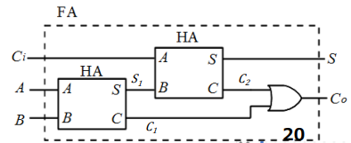
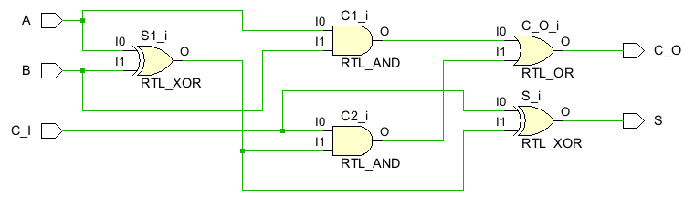
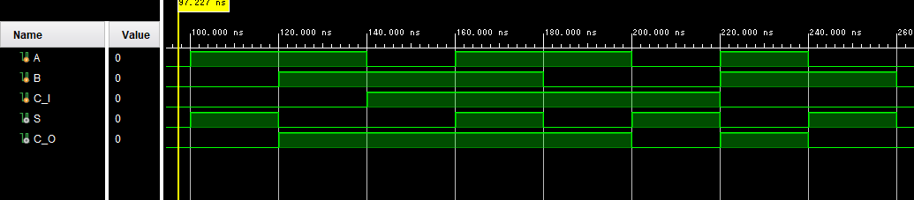
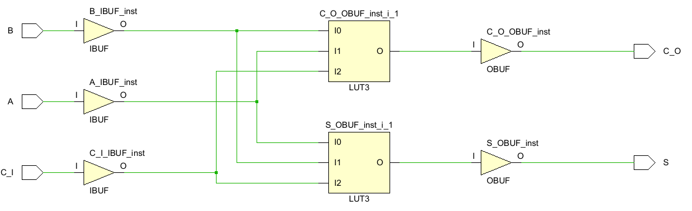
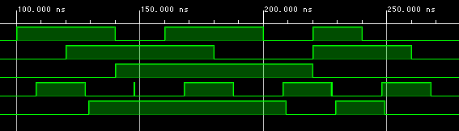

# FPGAの使い方

<div style="text-align: right;">
<h3>4I24 中川寛之</h3>
</div>

## 目標  
FPGAの概念を理解し、簡単な回路をVerilog HDL言語で記述できる

---

1.  FPGAの概要
2.  FPGAによる回路設計法
    1.  仕様設計
    2.  回路記述
    3.  動作確認  

## 演習

### 演習１ 
> 半加算器２個を用いて、全加算器を構成しなさい。  
> 


### 演習２
> 全加算器をVerilog HDLで記述しなさい。

```Verilog HDL
    wire S1, C1, C2;
    
    assign S1 = A ^ B;
    assign C1 = A & B;
    assign C2 = C_I & S1;
    assign S = C_I ^ S1;
    assign C_O = C1|C2;
```

### 演習３
> RTL解析を行いなさい。
> 


### 演習４
> テストベンチを作成しなさい。
```Verilog HDL
`timescale 1ns / 1ps

module test_fulladd;
    reg A ,B, C_I;
    wire S, C_O;
    
    fulladd uut(.A(A),.B(B),.C_I(C_I),.S(S),.C_O(C_O));
    
initial begin
        A=1'b0; B=1'b0; C_I=1'b0;
      #100;
        A=1'b1; B=1'b0; C_I=1'b0;#20;
        A=1'b1; B=1'b1; C_I=1'b0;#20;
        A=1'b0; B=1'b1; C_I=1'b1;#20;
        A=1'b1; B=1'b1; C_I=1'b1;#20;
        A=1'b1; B=1'b0; C_I=1'b1;#20;
        A=1'b0; B=1'b0; C_I=1'b1;#20;
        A=1'b1; B=1'b1; C_I=1'b0;#20;
        A=1'b0; B=1'b1; C_I=1'b0;#20;
        A=1'b0; B=1'b0; C_I=1'b0;#20;
    $stop;
end;
endmodule
```

### 演習５
> ビヘイビアシミュレーションを行いなさい。
> 


### 演習６
> ビヘイビアシミュレーションの結果から動作を確かめよ。  
>
| 入力 A | 入力 B | 入力 Ci | 出力 Co (仕様) | 出力 Co (動作) | 出力 S (仕様) | 出力 S (動作) | 合否 |
| :--- | :--- | :--- | :--- | :--- | :--- | :--- | :--- |
| 0 | 0 | 0 | 0| 0| 0| 0| 〇|
| 0 | 0 | 1 | 0| 0| 1| 1| 〇|
| 0 | 1 | 0 | 0| 0| 1| 1| 〇|
| 0 | 1 | 1 | 1| 1| 0| 0| 〇|
| 1 | 0 | 0 | 0| 0| 1| 1| 〇|
| 1 | 0 | 1 | 1| 1| 0| 0| 〇|
| 1 | 1 | 0 | 1| 1| 0| 0| 〇|
| 1 | 1 | 1 | 1| 1| 1| 1| 〇|

### 演習７
> 入出力端子を割り当てなさい。

割り当てました。

### 演習８
  


### 演習９  
> 配置配線、静的タイミング解析を行い、各端子間の遅延
を調べよ。

| From Port | To Port | Max Delay | Max Process Corner | Min Delay | Min Process Corner |
| :--- | :--- | :--- | :--- | :--- | :--- |
| A | C_O | 9.398 | SLOW | 2.874 | FAST |
| A | S | 8.182 | SLOW | 2.373 | FAST |
| B | C_O | 9.334 | SLOW | 2.835 | FAST |
| B | S | 8.117 | SLOW | 2.330 | FAST |
| C_I | C_O | 8.983 | SLOW | 2.741 | FAST |
| C_I | S | 7.798 | SLOW | 2.234 | FAST |  
  
### 演習１０  

> 結果からクリティカルパスおよび、その遅延時間を求めよ。  

| From Port | To Port | Max Delay | Max Process Corner | Min Delay | Min Process Corner |
| :--- | :--- | :--- | :--- | :--- | :--- |
| A | C_O | **9.398** | SLOW | 2.874 | FAST |

クリティカルパス： A -> C_O　　遅延時間： 9.398[ns]  

### 演習１１

> タイミングシミュレーションを行いなさい。  




### 演習１２  

> タイミングシミュレーションから遅延時間を測定せよ。(注、出力が安定した時点で読み取ること)  

| (初期値) | 0ns |100ns | 120ns | 140ns | 160ns | 180ns | 200ns | 220ns | 240ns |
| :--- | :--- | :--- | :--- | :--- | :--- | :--- | :--- | :--- | :--- |
| A | 0 | 1 | 1 | 0 | 1 | 1 | 0 | 1 | 0 | 0 |
| B | 0 | 0 | 1 | 1 | 1 | 0 | 0 | 1 | 1 | 0 |
| Ci | 0 | 0 | 0 | 1 | 1 | 1 | 1 | 0 | 0 | 0 |
| 遅延時間 | 8.056| 8.056| 7.992| 8.056| 8.056| 7.992| 8.056| 7.672| 8.056|

## マイコンとFPGAのちがい  

マイコンが「ソフトウェア」で動くのに対して、FPGAは「ハードウェア（回路）」そのものを書き換えて動く  

- マイコン(CPU)
    - 逐次処理：直列処理なので処理速度に限界がある
    - CPUに与えるプログラムはハードウェア上での動作を示す命令
- FPGA
    - 並列処理：ハードウェア回路を構成しているので高速処理が可能
    - FPGAに与えるコードは、FPGA内部を目的のハードウェアに構成


## ビヘイビアシミュレーションとタイミングシミュレーションとの違い

ビヘイビアシミュレーションとタイミングシミュレーションの違いは、**「回路の遅延（信号が伝わる時間）を考慮するかどうか」**

- ビヘイビアシミュレーション:  
 「論理的な正しさ」だけを確認する。  
 遅延はゼロとして扱うので高速。
- タイミングシミュレーション:   
「実際の遅延を含めても時間内に動作するか」を確認する。  
現実の動作に近いため低速。

## FPGAの使用例  
[参考元](https://www.ibm.com/think/topics/field-programmable-gate-arrays)

### データセンター
ネットワーク処理やストレージの高速化、AI推論のアクセラレータとして使用されている。特定の処理をハードウェア化することにより、CPUよりも高速かつ低消費電力での実行が可能。

---

### 画像処理・映像配信機器
放送局向けの映像スイッチャーや医療用の高精細ディスプレイなどで活用されている。複数の映像をリアルタイムで合成したり、色調を補正したりといった膨大な並列計算を瞬時に行う。

---

### ADAS（先進運転支援システム）と自動運転
カメラやレーダーなど複数のセンサーからの情報をリアルタイムで処理し、物体を認識するために使われている。低遅延で高速な処理が求められる、安全性が重要なシステムで中心的な役割を担う。  

##  本日の実験で理解したこと、感じたこと

FPGAを用いた実験を通じて、ハードウェア記述言語による回路設計の柔軟性と即時性を実感しました。  
シミュレーションと実機での動作確認により、論理設計の重要性や配線遅延などのタイミング制約の影響を理解できました。また、ソフトウェアとは異なり、並列処理が自然に実現できる点が印象的でした。  
デバッグでは論理アナライザやLEDを活用し、ハードウェア特有の検証手法を学びました。今後の組み込みシステム開発において、FPGAの特性を活かした設計が重要であると感じました。