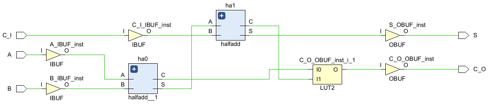
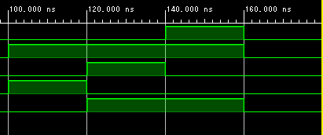
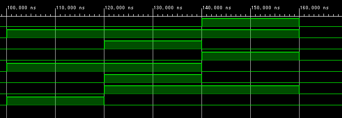

# FPGA実験１

## 目的

### 演習１ 
> 半加算器２個を用いて、全加算器を構成しなさい。  
> 


### 演習２
> 全加算器をVerilog HDLで記述しなさい。

```Verilog HDL
    wire S1, C1, C2;
    
    assign S1 = A ^ B;
    assign C1 = A & B;
    assign C2 = C_I & S1;
    assign S = C_I ^ S1;
    assign C_O = C1|C2;
```

### 演習３
> RTL解析を行いなさい。
> 


### 演習４
> テストベンチを作成しなさい。
```Verilog HDL
`timescale 1ns / 1ps

module test_fulladd;
    reg A ,B, C_I;
    wire S, C_O;
    
    fulladd uut(.A(A),.B(B),.C_I(C_I),.S(S),.C_O(C_O));
    
initial begin
        A=1'b0; B=1'b0; C_I=1'b0;
      #100;
        A=1'b1; B=1'b0; C_I=1'b0;#20;
        A=1'b1; B=1'b1; C_I=1'b0;#20;
        A=1'b0; B=1'b1; C_I=1'b1;#20;
        A=1'b1; B=1'b1; C_I=1'b1;#20;
        A=1'b1; B=1'b0; C_I=1'b1;#20;
        A=1'b0; B=1'b0; C_I=1'b1;#20;
        A=1'b1; B=1'b1; C_I=1'b0;#20;
        A=1'b0; B=1'b1; C_I=1'b0;#20;
        A=1'b0; B=1'b0; C_I=1'b0;#20;
    $stop;
end;
endmodule
```

### 演習５
> ビヘイビアシミュレーションを行いなさい。
> 


### 演習６
> ビヘイビアシミュレーションの結果から動作を確かめよ。  
>
| 入力 A | 入力 B | 入力 Ci | 出力 Co (仕様) | 出力 Co (動作) | 出力 S (仕様) | 出力 S (動作) | 合否 |
| :--- | :--- | :--- | :--- | :--- | :--- | :--- | :--- |
| 0 | 0 | 0 | 0| 0| 0| 0| 〇|
| 0 | 0 | 1 | 0| 0| 1| 1| 〇|
| 0 | 1 | 0 | 0| 0| 1| 1| 〇|
| 0 | 1 | 1 | 1| 1| 0| 0| 〇|
| 1 | 0 | 0 | 0| 0| 1| 1| 〇|
| 1 | 0 | 1 | 1| 1| 0| 0| 〇|
| 1 | 1 | 0 | 1| 1| 0| 0| 〇|
| 1 | 1 | 1 | 1| 1| 1| 1| 〇|

### 演習７
> 入出力端子を割り当てなさい。

割り当てました。

### 演習８
  


### 演習９  
> 配置配線、静的タイミング解析を行い、各端子間の遅延
を調べよ。

| From Port | To Port | Max Delay | Max Process Corner | Min Delay | Min Process Corner |
| :--- | :--- | :--- | :--- | :--- | :--- |
| A | C_O | 9.398 | SLOW | 2.874 | FAST |
| A | S | 8.182 | SLOW | 2.373 | FAST |
| B | C_O | 9.334 | SLOW | 2.835 | FAST |
| B | S | 8.117 | SLOW | 2.330 | FAST |
| C_I | C_O | 8.983 | SLOW | 2.741 | FAST |
| C_I | S | 7.798 | SLOW | 2.234 | FAST |  
  
### 演習１０  

> 結果からクリティカルパスおよび、その遅延時間を求めよ。  

| From Port | To Port | Max Delay | Max Process Corner | Min Delay | Min Process Corner |
| :--- | :--- | :--- | :--- | :--- | :--- |
| A | C_O | **9.398** | SLOW | 2.874 | FAST |

クリティカルパス： A -> C_O　　遅延時間： 9.398[ns]  

### 演習１１

> タイミングシミュレーションを行いなさい。  


### 演習１２  

> タイミングシミュレーションから遅延時間を測定せよ。(注、出力が安定した時点で読み取ること)  

| (初期値) | 0ns |100ns | 120ns | 140ns | 160ns | 180ns | 200ns | 220ns | 240ns |
| :--- | :--- | :--- | :--- | :--- | :--- | :--- | :--- | :--- | :--- |
| A | 0 | 1 | 1 | 0 | 1 | 1 | 0 | 1 | 0 | 0 |
| B | 0 | 0 | 1 | 1 | 1 | 0 | 0 | 1 | 1 | 0 |
| Ci | 0 | 0 | 0 | 1 | 1 | 1 | 1 | 0 | 0 | 0 |
| 遅延時間 | 8.056| 8.056| 7.992| 8.056| 8.056| 7.992| 8.056| 7.672| 8.056|

---  

### 演習１

> 半加算器の動作を確認せよ。  


| | 入力 | | 出力 | | | 合否 |
| :--- | :--- | :--- | :--- | :--- | :--- | :--- |
| | A | B | C | | S | | |
| | | | 仕様 | 動作 | 仕様 | 動作 | |
| | 0 | 0 | 0 | 0| 0 | 0| |
| | 0 | 1 | 0 | 0| 1 | 1| |
| | 1 | 0 | 0 | 0| 1 | 1| |
| | 1 | 1 | 1 | 1| 0 | 1| |

### 演習２
> プログラムを完成せよ  

```Verilog HDL
module fulladd(
    input A, B, C_I,
    output C_O, S
    );
 
    wire S1, C1, C2;
   
    halfadd ha0(.A(A), .B(B), .C(C1), .S(S1)); 
    halfadd ha1(.A(S1), .B(C_I), .C(C2), .S(S));
 
    assign C_O = C1|C2;        
endmodule
```

  

### 演習３
> テストベンチを編集し、完成せよ。

  

### 演習４
> ビヘイビアシュミレーションで動作を確認せよ。（内部状態が正しいことを確認する。）　　

  
  
| 入力信号 | | 内部信号 | | | | 出力信号 | | 動作結果 |
| :--- | :--- | :--- | :--- | :--- | :--- | :--- | :--- | :--- |
| A | B | CI | C1 | S1 | C2 | C_O | S | (合/否) |
| 0 | 1 | 0 | 0| 1| 0| 0| 1| 合|
| 0 | 1 | 1 | 0| 1| 1| 1| 0| 合|
| 1 | 1 | 0 | 1| 0| 0| 1| 0| 合|
| 0 | 0 | 0 | 0| 0| 0| 0| 0| 合|  


### 演習５  

> FPGAのピン番号を調べ、ピン配置を行いなさい。

| 回路記号 | スイッチ/LED | FPGA端子ピン番号 | 回路記号 | スイッチ/LED | FPGA端子ピン番号 |
| :--- | :--- | :--- | :--- | :--- | :--- |
| A[3] | SW4 | W15| S[3] | LD3 | V19|
| A[2] | SW3 | W17| S[2] | LD2 | U19|
| A[1] | SW2 | W16| S[1] | LD1 | E19|
| A[0] | SW1 | V16| S[0] | LD0 | U16|
| B[3] | SW8 | V2| C_I | SW0 | V17|
| B[2] | SW7 | W13| C_O | LD4 | W18|
| B[1] | SW6 | W14| | | |
| B[0] | SW5 | V15| | | |  


### 演習６  
> テストパターンを作成せよ。

| 代表パターン | | | 出力 | モジュールの接続 | | | 出力 |
| :--- | :--- | :--- | :--- | :--- | :--- | :--- | :--- |
| A | B | C_I | C_O | C3 | C2 | C1 | S |
| 1100 | 0011 | 0 | 0 | 0 | 0 | 0 | 1111 |
| 0101 | 1000 | 1 | 0 | 0 | 0 | 1 | 1110 |
| | | | 0 | 0 | 1 | 0 | |
| | | | 0 | 1 | 0 | 0 | |
| | | | 1 | 0 | 0 | 0 | |
| | | | 1 | 1 | 1 | 1 | |