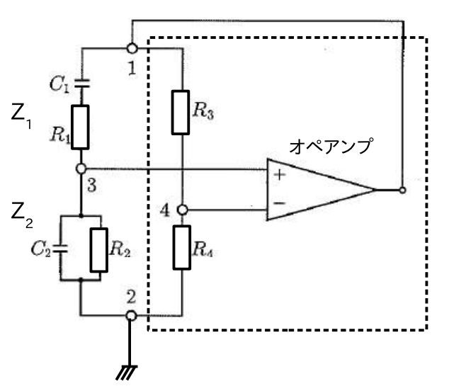
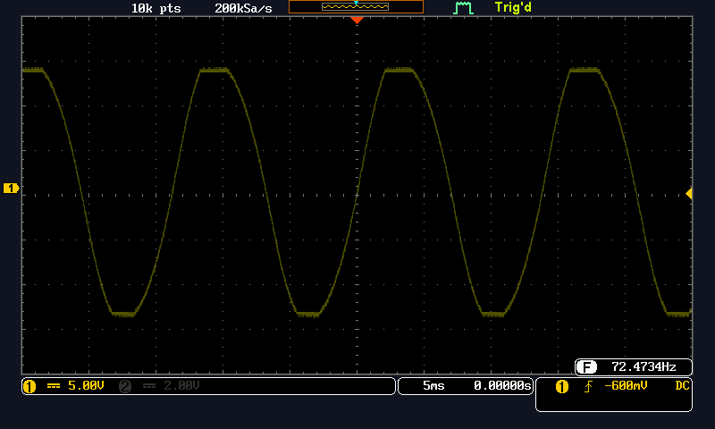
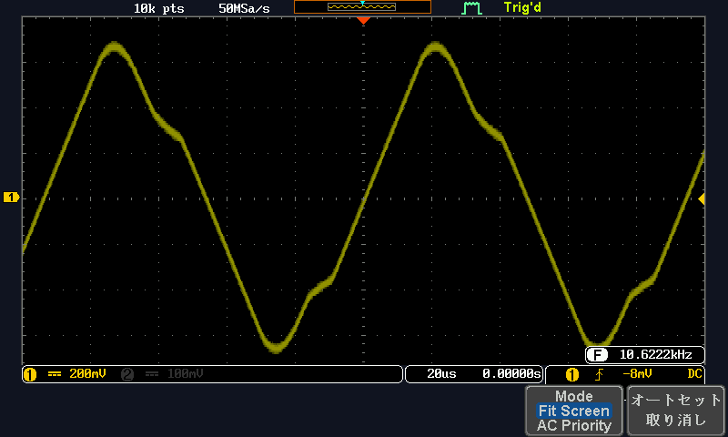

# RC発振回路の設計製作

<h3>4I24 中川寛之</h3>

  

## 1. 目的
RCの発振回路を設計製作し、その特性を測定する

## 2. 手法
1. RC発振回路を設計する
2. RC発振回路を制作する(今回はウィーンブリッジ発振回路で制作)
3. 測定し、結果を記録する

## 3. 使用機材
- オペアンプ (LM358)
- オシロスコープ (テクトロニクス社製 TDS2002B)
- 電源 (TEXIO PW-A)
- ファンクションジェネレータ(デバック時のみ)

## 4. 実験
### 1.RC発振回路設計(制作)
今実験ではウィーンブリッジ発振回路を作成した。  
また発振周波数の式は(1)
$$\begin{equation}
\omega = \frac{1}{\sqrt{C_1 C_2 R_1 R_2}}
\qquad
\left(
f = \frac{1}{2\pi \sqrt{C_1 C_2 R_1 R_2}}
\right)
\end{equation}$$
であるが今回の発振周波数の計算短縮も踏まえてインピーダンス及び、抵抗を同じ値のものを使用することにした。  
そのため、発振周波数回路はこのような式になる。
$$\begin{equation}
f = \frac{1}{2\pi C R}
\end{equation}$$

加えて、ウィーンブリッジ発振回路の発振条件として、電圧利得A(非反転増幅回路)と電圧帰還率Fの積が AF ≥ 1 を満たす必要がある。

式(2)で示した $C_1 = C_2 = C$、$R_1 = R_2 = R$ の条件において、
- 電圧帰還率 F は
$$
\begin{equation}
F = \frac{1}{3}
\end{equation}$$

- 振幅条件は AF ≥ 1 より
$$
\begin{equation}
A \geq 3
\end{equation}
$$
となる。実際には発振を確実にするため $A > 3$ とし、式(2),(3),(4)を満たす発振回路の設計を行った。

#### 回路図(ウィーンブリッジ発振回路)
  

### 3.実験結果

### (a) 1KHz未満

#### 設計内容
| 項目 | 値 |
|------|------|
| R (R1=R2) | 2 kΩ |
| C (C1=C2) | 1 μF |
| R3 | 2 kΩ |
| R4 | 1 kΩ |
| 利得 A | 3 (抵抗の誤差によりうまく動作確認) |

#### 波形

#### 発振周波数の理論値計算
式(2)より、
$$
f = \frac{1}{2\pi CR} = \frac{1}{2\pi \times 1 \times 10^{-6} \times 2 \times 10^{3}} = \frac{1}{4\pi \times 10^{-3}} \approx 79.58 \text{ [Hz]}
$$

#### 測定結果
| 項目 | 値 |
|------|------|
| 理論値 | 79.58 Hz |
| 実測値 | 72.47 Hz |
| 誤差率 | 8.9% |

### (b) 10kHz以上

#### 設計内容
| 項目 | 値 |
|------|------|
| R (R1=R2) | 2 kΩ |
| C (C1=C2) | 4700 pF |
| R3 | 16 kΩ |
| R4 | 7.5 kΩ |
| 利得 A | 3.13 |

#### 波形

#### 発振周波数の理論値計算
式(2)より、
$$
f = \frac{1}{2\pi CR} = \frac{1}{2\pi \times 4.7 \times 10^{-9} \times 2 \times 10^{3}} = \frac{1}{2\pi \times 9.4 \times 10^{-6}} \approx 16.93 \text{ [kHz]}
$$

#### 測定結果
| 項目 | 値 |
|------|------|
| 理論値 | 16.93 kHz |
| 実測値 | 10.62 kHz |
| 誤差率 | 37.3% |

## 5. 考察

### 1. 理論値と実測値の比較

#### (a) 1KHz未満の実験
理論値79.58 Hzに対して実測値72.47 Hzとなり、誤差率は8.9%であった。この誤差は比較的小さく、設計通りに動作していることが確認できた。

#### (b) 10kHz以上の実験
理論値16.93 kHzに対して実測値10.62 kHzとなり、誤差率は37.3%と大きな値となった。この大きな誤差の原因として、以下が考えられる。

### 2. 誤差の原因

#### (a) 部品の誤差
- 抵抗やコンデンサには製造誤差があり、特にコンデンサは10〜20%程度の誤差を持つものが多い
- (b)の実験で使用した4700 [pF]のコンデンサは小容量であるため、誤差の影響が大きく現れた可能性がある

#### (b) 寄生容量の影響
- 高周波領域では、配線やブレッドボードの寄生容量が無視できなくなる
- (b)の実験では理論上16.93 [kHz]と高い周波数であるため、寄生容量により実効的なコンデンサ容量が増加し、発振周波数が低下したと考えられる

#### (c) オペアンプの周波数特性
- オペアンプには周波数帯域の制限があり、高周波になるほど利得が低下する
- 10 [kHz]以上の周波数では、オペアンプの特性により発振条件が変化した可能性がある

### 3. 電圧利得と波形の関係

今回の実験では電圧利得Aを調整する機会が多々あり、以下の知見が得られた。

#### 電圧利得 A ≈ 3 の場合
- 発振条件 A > 3 をちょうど満たす状態
- オシロスコープで観測した波形は、きれいな正弦波として確認できた
- これは、増幅が適切で歪みが少ない状態であることを示している

#### 電圧利得 A >> 3 の場合
- 発振条件は満たすが、過剰な増幅により非線形動作に入る
- 出力波形が矩形波のように歪んだ波形となった
- オペアンプの飽和領域に達したことで、正弦波が上下にクリップされたと考えられる

### 4. 最適な電圧利得の設定

ウィーンブリッジ発振回路では、理論上 $A = 3$ が理想値である。しかし実際には：
- 抵抗値の誤差を考慮して $A$ を 3 よりわずかに大きく設定する必要がある
- 今回の実験では、(a)で $A = 3.0$、(b)で $A = 3.13$ とし、いずれも安定した発振を得ることができた
- $A$ を大きくしすぎると波形が歪むため、3に近い値で調整することが重要である

## 6. 振り返り・感想

今回の実験を通して、RC発振回路の設計と製作を行い、理論と実際の動作について理解を深めることができた。

特に印象的だったのは、電圧利得の調整による波形の変化である。教科書では「$A > 3$」という条件のみが示されているが、実際には$A = 3$に近い値で調整することで、きれいな正弦波が得られることを体験できた。電圧利得が大きすぎると矩形波のような歪んだ波形になることも確認でき、理論的な条件を満たすだけでなく、適切な値に調整する重要性を学んだ。

また、(b)の10 kHz以上の実験では、理論値と実測値の間に大きな誤差が生じた。これは寄生容量やオペアンプの周波数特性など、低周波では無視できていた要因が高周波領域で顕在化したためと考えられる。実際の回路設計では、こうした非理想的な要素を考慮する必要があることを実感した。