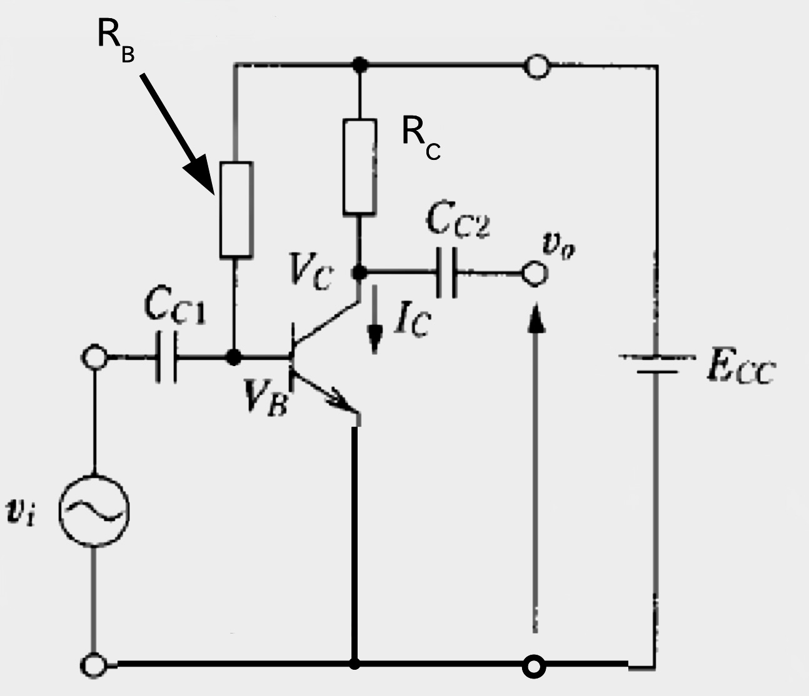

# 小信号増幅回路

<h3>
4I24 中川寛之  </h3>
<h4>
[ 共同実験者 ]
4I17 小林愛侑
</h4>

  

## 1. 目的
小信号増幅回路を設計製作し、その特性を測定する。

## 2. 手法
1. 増幅回路を設計する
2. 増幅回路を制作する
3. 測定し、結果を記録する

## 3. 環境及び使用機器
[ 環境 ]  
・実験実施日程：1月29日  
・温度：21度  
・湿度：22%

[ 使用機器 ]  
・トランジスタ：TOSHIBA (2SC1815/GR)  
・直流電源：TEXIO PW-A  
・オシロスコープ：テクトロニクス社製 TDS2002B  
・ファンクションジェネレーター：TEXIO FG-274  

## 4. 実験
### 4-1.設計　　

#### 設計の目的と使用デバイス

東芝製トランジスタ 2SC1815（ランク：GR）を使用し、電源電圧 $V_{CC}=6\,\mathrm{V}$ で動作するA級小信号増幅回路を設計する。

#### 設計条件

- 電源電圧：$V_{CC} = 6\,\mathrm{V}$
- 使用トランジスタ：2SC1815-GR
- 直流電流増幅率：$h_{FE} = 300$
- ベース–エミッタ間電圧：$V_{BE} = 0.6\,\mathrm{V}$

#### 動作点（Q点）の決定

##### コレクタ–エミッタ間電圧 $V_{CE}$
最大出力振幅を確保するため、無信号時の動作点を電源電圧の半分に設定する。

$$
V_{CE} = \frac{1}{2} V_{CC}
$$

$$
V_{CE} = \frac{1}{2} \times 6 = 3\,\mathrm{V}
$$

##### コレクタ電流 $I_C$ とコレクタ抵抗 $R_C$
コレクタ抵抗を
$$
R_C = 1.5\,\mathrm{k\Omega}
$$
とする。

このとき、抵抗 $R_C$ による電圧降下は
$$
V_{RC} = V_{CC} - V_{CE} = 6 - 3 = 3\,\mathrm{V}
$$
となる。

よって、コレクタ電流は
$$
I_C = \frac{V_{RC}}{R_C}
$$

$$
I_C = \frac{3}{1.5 \times 10^3} = 2.0 \times 10^{-3}\,\mathrm{A} = 2\,\mathrm{mA}
$$

#### バイアス回路の定数計算

##### ベース電流 $I_B$
トランジスタの直流電流増幅率より、
$$
I_C = h_{FE} \cdot I_B
$$
が成り立つ。

したがって、
$$
I_B = \frac{I_C}{h_{FE}}
$$

$$
I_B = \frac{2.0 \times 10^{-3}}{300} \approx 6.67 \times 10^{-6}\,\mathrm{A} = 6.67\,\mu\mathrm{A}
$$

##### ベースバイアス抵抗 $R_B$
固定バイアス回路におけるベース抵抗 $R_B$ は、
$$
R_B = \frac{V_{CC} - V_{BE}}{I_B}
$$
で与えられる。

$$
R_B = \frac{6 - 0.6}{6.6 \times 10^{-6}}
$$

$$
R_B \approx 8.18 \times 10^5\,\Omega = 818\,\mathrm{k\Omega}
$$

#### 設計結果まとめ

| パラメータ | 設定値 |
|:---:|:---:|
| コレクタ抵抗 $R_C$ | $1.5\,\mathrm{k\Omega}$ |
| ベースバイアス抵抗 $R_B$ | $818\,\mathrm{k\Omega}$ |

### 4-2.制作
下記のような回路図を作成した。

| 部品 | 定数 |
|:---:|:---:|
| Rc | 1.5kΩ |
| Rb | 800kΩ |
| C1 | 10µF |
| C2 | 10µF |

> ここでトランジスタのエミッターとコレクターの接続を逆にするミスを犯してしまった。   

### 4-3.測定

p−p
​	
  に対し出力電圧は約 3.8V 
p−p
​	
 となり、本回路構成（入力減衰を含む）における電圧利得は 約 4.9 倍 を記録した。
初期の測定において、出力波形の上下が切り取られる飽和現象（サチュレーション）が確認された。これは入力信号の振幅が過大であり、増幅後の電圧が電源電圧の範囲を超えたことに起因する。

対策として、信号源とベース入力の間に $39\,\mathrm{k\Omega}$ の抵抗を直列に挿入し、入力信号レベルを減衰させた。これにより、飽和のない良好な正弦波出力を得ることに成功した。

オシロスコープによる測定の結果、入力電圧 $V_{\mathrm{in}} = 0.78\,\mathrm{V_{p-p}}$ に対し、出力電圧は約 $V_{\mathrm{out}} = 3.8\,\mathrm{V_{p-p}}$ となり、本回路構成（入力減衰を含む）における電圧利得は
$$
A_v = \frac{V_{\mathrm{out}}}{V_{\mathrm{in}}} = \frac{3.8}{0.78} \approx 4.9
$$
倍を記録した。
 
### 4-4.考察

| 項目 | 条件 | 値 (倍率) | 備考 |
|:---:|:---:|:---:|:---|
| 理論値 | 抵抗追加なし (初期設計)| 約 115 倍[*1]  | 入力信号がそのまま増幅される計算 |
| 理論値 | 39kΩ 追加後 | 約 10.5 倍 | 入力抵抗(3.9kΩ)との分圧により信号が約1/11に減衰するため |
| 実測値 | 39kΩ 追加後 | 約 4.9 倍 | オシロスコープ画像より算出 (3.8V÷0.78V) |  

[*1]
理論値（抵抗追加なし）：約 115倍

$$
A_v = h_{fe} \times \frac{R_C}{h_{ie}} = 300 \times \frac{1500}{3900} \approx 115.4
$$

理論値と実測値との倍率の差の理由

理論値と実測値で利得に大きな差が生じた原因について考察する。

最大の要因は、トランジスタの性能の個体差であると考える。設計計算では電流増幅率（$h_{FE}$）を代表値である300として用いたが、実際の素子の $h_{FE}$ は150程度と、これを大きく下回っていたため、利得が計算値の半分近くまで低下したと考察する。

また、この $h_{FE}$ の低下に伴い、入力インピーダンスが変動し、結果として入力信号がさらに減衰したことも、利得低下の一因であると考える。  

## 5. 振り返り・感想  

今回の実験では、トランジスタを用いた小信号増幅回路の設計・制作・測定を通じて、理論と実際の回路の違いを体感することができた。特に、設計値と実測値の間に差が生じたことで、トランジスタの個体差や回路パラメータの変動が実際の回路動作に与える影響を理解することができた。  
また、飽和現象への対策として抵抗を追加することで波形を改善できた経験は、実践的なトラブルシューティングの重要性を学ぶ良い機会となった。今後は、理論計算だけでなく実測による確認と調整を重視した回路開発を行っていきたい。