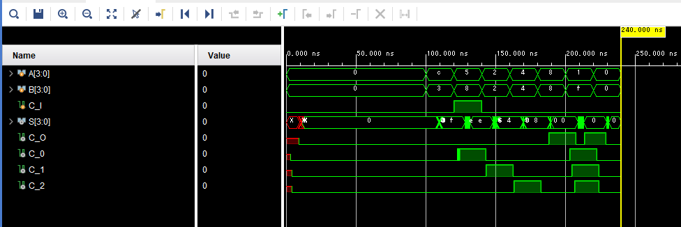
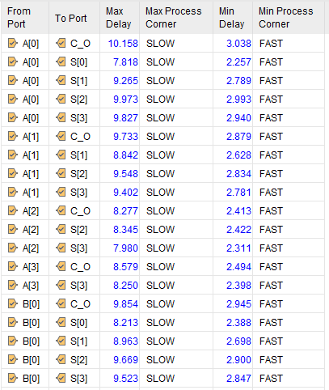
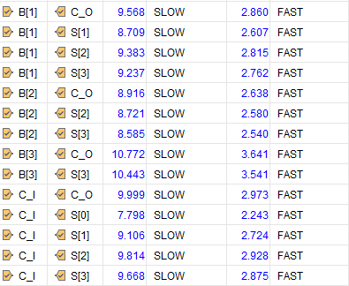
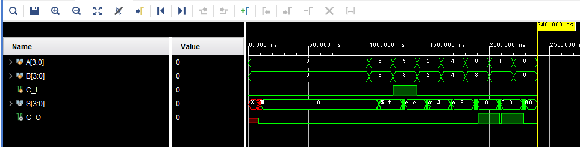
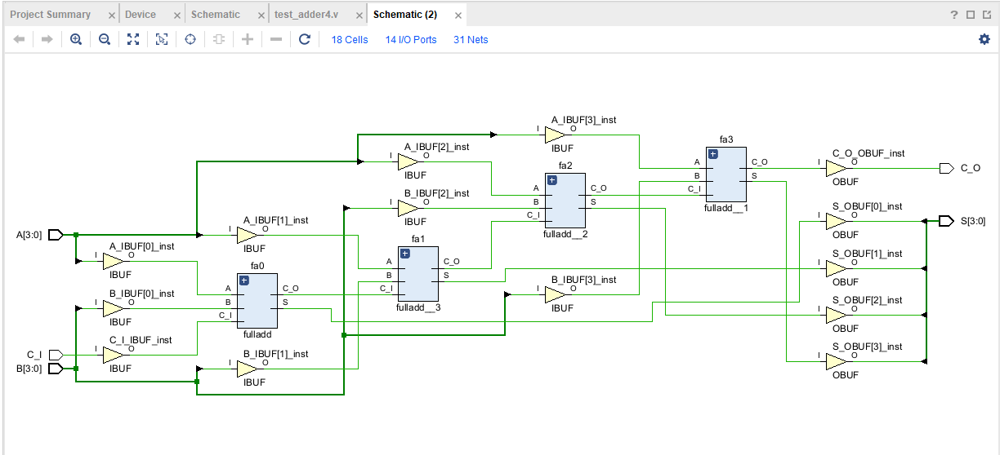

<style>
.column-left{
  float: left;
  width: 47.5%;
  text-align: left;
}
.column-right{
  float: right;
  width: 47.5%;
  text-align: left;
}
.column-one{
  float: left;
  width: 100%;
  text-align: left;
}
</style>

# 階層化設計

<div style="text-align: right;">
<h3>4I24 中川寛之</h3>
</div>  

## 目標  
- 階層化設計のメリット、デメリットを理解する
- 4bit加算器を全加算器を用いて作成する

### 演習１

> 半加算器の動作を確認せよ。  


| | 入力 | | 出力 | | | 合否 |
| :--- | :--- | :--- | :--- | :--- | :--- | :--- |
| | A | B | C | | S | | |
| | | | 仕様 | 動作 | 仕様 | 動作 | |
| | 0 | 0 | 0 | 0| 0 | 0| |
| | 0 | 1 | 0 | 0| 1 | 1| |
| | 1 | 0 | 0 | 0| 1 | 1| |
| | 1 | 1 | 1 | 1| 0 | 1| |

### 演習２
> プログラムを完成せよ  

```Verilog HDL
module fulladd(
    input A, B, C_I,
    output C_O, S
    );
 
    wire S1, C1, C2;
   
    halfadd ha0(.A(A), .B(B), .C(C1), .S(S1)); 
    halfadd ha1(.A(S1), .B(C_I), .C(C2), .S(S));
 
    assign C_O = C1|C2;        
endmodule
```

  

### 演習３
> テストベンチを編集し、完成せよ。

  

### 演習４
> ビヘイビアシュミレーションで動作を確認せよ。（内部状態が正しいことを確認する。）　　

  
  
| 入力信号 | | 内部信号 | | | | 出力信号 | | 動作結果 |
| :--- | :--- | :--- | :--- | :--- | :--- | :--- | :--- | :--- |
| A | B | CI | C1 | S1 | C2 | C_O | S | (合/否) |
| 0 | 1 | 0 | 0| 1| 0| 0| 1| 合|
| 0 | 1 | 1 | 0| 1| 1| 1| 0| 合|
| 1 | 1 | 0 | 1| 0| 0| 1| 0| 合|
| 0 | 0 | 0 | 0| 0| 0| 0| 0| 合|  

### 演習５

> ４ビット加算器を完成せよ。

```Verilog HDL
    module adder4(
        input[3:0] A,
        input[3:0] B,
        output[3:0] S,
        input C_I,
        output C_O
    );
    wire[3:1] C;
    fulladd fa3(.A(A[3]), .B(B[3]), .C_I([3]), .C_O(C_O), .S(S[3]));
    fulladd fa2(.A(A[2]), .B(B[2]), .C_I([2]), .C_O(C[3]), .S(S[2]));
    fulladd fa1(.A(A[1]), .B(B[1]), .C_I([1]), .C_O(C[2]), .S(S[1]));
    fulladd fa0(.A(A[0]), .B(B[0]), .C_I([0]), .C_O(C[1]), .S(S[0]));
    endmodule
```


### 演習６  

> FPGAのピン番号を調べ、ピン配置を行いなさい。

| 回路記号 | スイッチ/LED | FPGA端子ピン番号 | 回路記号 | スイッチ/LED | FPGA端子ピン番号 |
| :--- | :--- | :--- | :--- | :--- | :--- |
| A[3] | SW4 | W15| S[3] | LD3 | V19|
| A[2] | SW3 | W17| S[2] | LD2 | U19|
| A[1] | SW2 | W16| S[1] | LD1 | E19|
| A[0] | SW1 | V16| S[0] | LD0 | U16|
| B[3] | SW8 | V2| C_I | SW0 | V17|
| B[2] | SW7 | W13| C_O | LD4 | W18|
| B[1] | SW6 | W14| | | |
| B[0] | SW5 | V15| | | |  


### 演習７  
> テストパターンを作成せよ。

| 代表パターン | | | 出力 | モジュールの接続  | 出力 |
| :--- | :--- | :--- | :--- | :--- | :--- |
| A | B | C_I | C_O | C3  C2  C1 | S |
| 1100 | 0011 | 0 | 0 | 0  0  0 | 1111 |
| 0101 | 1000 | 1 | 0 | 0  0  1 | 1110 |
| 0010 | 0010 | 0 | 0 | 0  1  0 | 0100 |
| 0100 | 0100 | 0 | 0 | 1  0  0 | 1000 |
| 1000 | 1000 | 0 | 1 | 0  0  0 | 0000 |
| 0001 | 1111 | 0 | 1 | 1  1  1 | 0000 |  

### 演習８  

<div class="column-left">  


</div>
<div class="column-right">  

  
</div>  
<div class="column-one">  

B[0] -> Co  
最大遅延時間は **14.092[s]**  
</div>　　
<div class="column-one">  </d>


### 演習９
> テストベンチを作成し、タイミングシュミレーションで動作を確認しなさい。（内部状態が正しいことを確認する）



内部状態が正しいことが確認できた  

### 演習１０  
> 最大遅延時間を調べなさい。（静的タイミング解析）  

<div class="column-left">


</div>
<div class="column-right">


</div>
<div class="column-one">  
  
B[3] -> Co  
最大遅延時間は **10.772[s]**  

</div>　　
<div class="column-one">  </d>


### 演習１１  
> テストベンチを作成し、タイミングシュミレーションで動作を確
認しなさい。（入出力のみでよい）  

  


## 考察  
> なぜ、階層化（モジュール化）が必要なのか。自分の言葉で説明せよ。  

設計の複雑さを管理し、効率と品質を向上させるため  
-> 大規模な回路を機能単位の部品に分割することで設計、検証、デバック等が容易になる  

> ４ビット加算器を作成し、フラットを解除してタイミングシミュレーションで動作を確かめよ。（加算器概要、生成された回路、動作確認事項など） 

演習1-11で確認済  
回路：
  

> 階層を保持しない場合(full or Rebuilt)と保持した場合(none)で、デバイス利用率(LUT数)や遅延時間はどうなったか。また、それはなぜか。  

階層を保持しない方が、ツールが全体的な論理とタイミングの最適化を自由に行えるため、効率が向上する。一方で階層保持は最適化を抑制する。

|比較項目	|階層を保持しない (Full/Rebuilt)	|階層を保持する (None)|  
|---|---|---|
|デバイス利用率 (LUT数)|	少なくなる|	多くなる|
|遅延時間|	短くなる|	長くなる|  

> FPGAはLUTで機能（回路）を構成している。その仕組みを調べよ。  

LUT（Look-Up Table）は、SRAM（コンフィギュレーションメモリ）を真理値表として利用し、組み合わせ回路を実現する。

仕組み:  
入力信号をSRAMのアドレスとして使用し、そのアドレスに格納されているデータ（0または1）を論理出力とする。SRAMのデータを書き換えることで、任意の論理機能（AND、ORなど）を柔軟に構成できる。  
[参考文献](https://www.fpgaland.tech/lut_of_fpga/)

> FPGAはいろいろなI/O規格に対応している。各自３規格選び調べよ。（電圧の違いを除く） 

- LVCMOS (Low-Voltage CMOS):

    方式: シングルエンド。最も基本的で汎用的なCMOS信号レベル。低～中速のパラレル通信に使用。[参考文献](https://ja.wikipedia.org/wiki/LVCMOS)

- LVDS (Low-Voltage Differential Signaling):

    方式: 差動。2本の信号線の電位差で情報を伝達。ノイズに強く、高速伝送に適する。[参考文献](https://emb.macnica.co.jp/articles/7396/)

- SSTL (Stub Series Terminated Logic):

    方式: シングルエンド。高速メモリインターフェース（DDR SDRAMなど）に特化。終端抵抗により信号整合性を確保。[参考文献](https://docs.amd.com/r/ja-JP/ug861-ultrascale-selectio/SSTL)