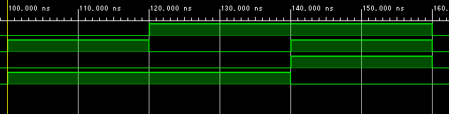

### 演習１

> 半加算器の動作を確認せよ。  



| | 入力 | | 出力 | | | 合否 |
| :--- | :--- | :--- | :--- | :--- | :--- | :--- |
| | A | B | C | | S | | |
| | | | 仕様 | 動作 | 仕様 | 動作 | |
| | 0 | 0 | 0 | 0| 0 | 0| |
| | 0 | 1 | 0 | 0| 1 | 1| |
| | 1 | 0 | 0 | 0| 1 | 1| |
| | 1 | 1 | 1 | 1| 0 | 1| |

### 演習２
> プログラムを完成せよ  

```Verilog HDL
module fulladd(
    input A, B, C_I,
    output C_O, S
    );
 
    wire S1, C1, C2;
   
    halfadd ha0(.A(A), .B(B), .C(C1), .S(S1)); 
    halfadd ha1(.A(S1), .B(C_I), .C(C2), .S(S));
 
    assign C_O = C1|C2;        
endmodule
```

  

### 演習３
> テストベンチを編集し、完成せよ。

  

### 演習４
> ビヘイビアシュミレーションで動作を確認せよ。（内部状態が正しいことを確認する。）　　

  
  
| 入力信号 | | 内部信号 | | | | 出力信号 | | 動作結果 |
| :--- | :--- | :--- | :--- | :--- | :--- | :--- | :--- | :--- |
| A | B | CI | C1 | S1 | C2 | C_O | S | (合/否) |
| 0 | 1 | 0 | 0| 1| 0| 0| 1| 合|
| 0 | 1 | 1 | 0| 1| 1| 1| 0| 合|
| 1 | 1 | 0 | 1| 0| 0| 1| 0| 合|
| 0 | 0 | 0 | 0| 0| 0| 0| 0| 合|  


### 演習５  

> FPGAのピン番号を調べ、ピン配置を行いなさい。

| 回路記号 | スイッチ/LED | FPGA端子ピン番号 | 回路記号 | スイッチ/LED | FPGA端子ピン番号 |
| :--- | :--- | :--- | :--- | :--- | :--- |
| A[3] | SW4 | W15| S[3] | LD3 | V19|
| A[2] | SW3 | W17| S[2] | LD2 | U19|
| A[1] | SW2 | W16| S[1] | LD1 | E19|
| A[0] | SW1 | V16| S[0] | LD0 | U16|
| B[3] | SW8 | V2| C_I | SW0 | V17|
| B[2] | SW7 | W13| C_O | LD4 | W18|
| B[1] | SW6 | W14| | | |
| B[0] | SW5 | V15| | | |  


### 演習６  
> テストパターンを作成せよ。

| 代表パターン | | | 出力 | モジュールの接続 | | | 出力 |
| :--- | :--- | :--- | :--- | :--- | :--- | :--- | :--- |
| A | B | C_I | C_O | C3 | C2 | C1 | S |
| 1100 | 0011 | 0 | 0 | 0 | 0 | 0 | 1111 |
| 0101 | 1000 | 1 | 0 | 0 | 0 | 1 | 1110 |
| | | | 0 | 0 | 1 | 0 | |
| | | | 0 | 1 | 0 | 0 | |
| | | | 1 | 0 | 0 | 0 | |
| | | | 1 | 1 | 1 | 1 | |