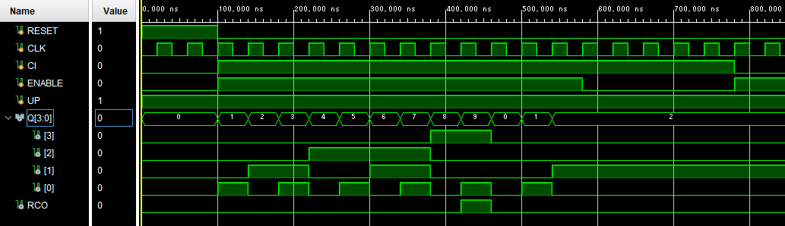
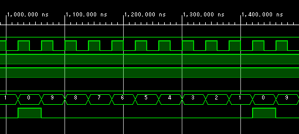
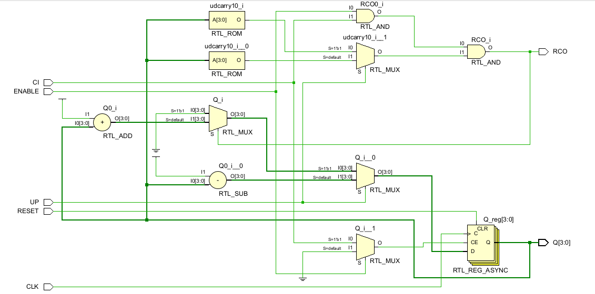
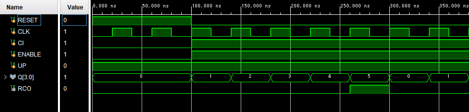
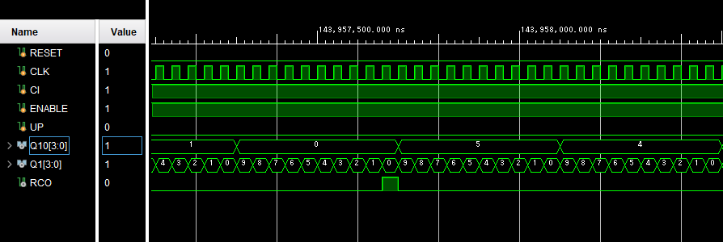
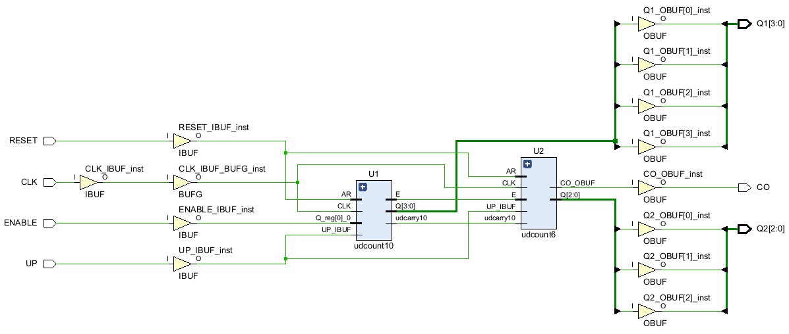

## 10進



  

```Verilog
`timescale 1ns / 1ps

module count10(
    input RESET,
    input CLK,
    input CI,
    input ENABLE,
    input UP,
    output reg[3:0] Q = 4'd0,
    output RCO
    );
    
    function udcarry10;
        input [3:0] Q;
        input UP;
        
        if(UP == 1'b1) begin //アップカウント
            if(Q == 4'd9) udcarry10 = 1'b1;
            else udcarry10 = 1'b0;
        end else begin
            if(Q == 4'd0) udcarry10 = 1'b1;
            else udcarry10 = 1'd0;
        end
     endfunction 
    
always @(posedge CLK or posedge RESET) begin
        if(RESET == 1'b1) begin
            Q <= 4'd0;
        end
        else if(ENABLE == 1'b1 && CI == 1'b1) begin
            if(UP == 1'b1) begin
                if(Q == 4'd9) begin
                    Q <= 4'd0;
                end
                else begin
                    Q <= Q + 4'd1;
                end
            end 
            else begin
                if(Q == 4'd0) begin
                    Q <= 4'd9;
                end
                else begin
                    Q <= Q - 4'd1;
                end
            end
        end
    end
    assign RCO = (ENABLE == 1'b1) && (CI == 1'b1) && udcarry10(Q, UP);
endmodule
```  

## 6進  




```Verilog
`timescale 1ns / 1ps

module count6(
    input RESET,
    input CLK,
    input CI,
    input ENABLE,
    input UP,
    output reg[3:0] Q = 4'd0, 
    output RCO
    );
    function udcarry6;
        input [3:0] Q;
        input UP;
        
        if(UP == 1'b1) begin //アップカウント
            if(Q == 4'd5) udcarry6 = 1'b1;
            else udcarry6 = 1'b0;
        end else begin //ダウンカウント
            if(Q == 4'd0) udcarry6 = 1'b1;
            else udcarry6 = 1'd0;
        end
    endfunction
    

    always @(posedge CLK or posedge RESET) begin
        if(RESET == 1'b1) begin
            Q <= 4'd0;
        end
        else if(ENABLE == 1'b1 && CI == 1'b1) begin
            
            if(UP == 1'b1) begin // --- アップカウント ---
                if(Q == 4'd5) begin
                    Q <= 4'd0; 
                end
                else begin
                    Q <= Q + 4'd1;
                end
            end 
            else begin // --- ダウンカウント ---
                if(Q == 4'd0) begin
                    Q <= 4'd5; 
                end
                else begin
                    Q <= Q - 4'd1;
                end
            end
        end
    end
    assign RCO = (ENABLE == 1'b1) && (CI == 1'b1) && udcarry6(Q, UP);
endmodule
```

## 60進



