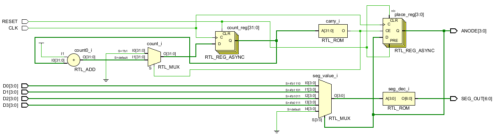
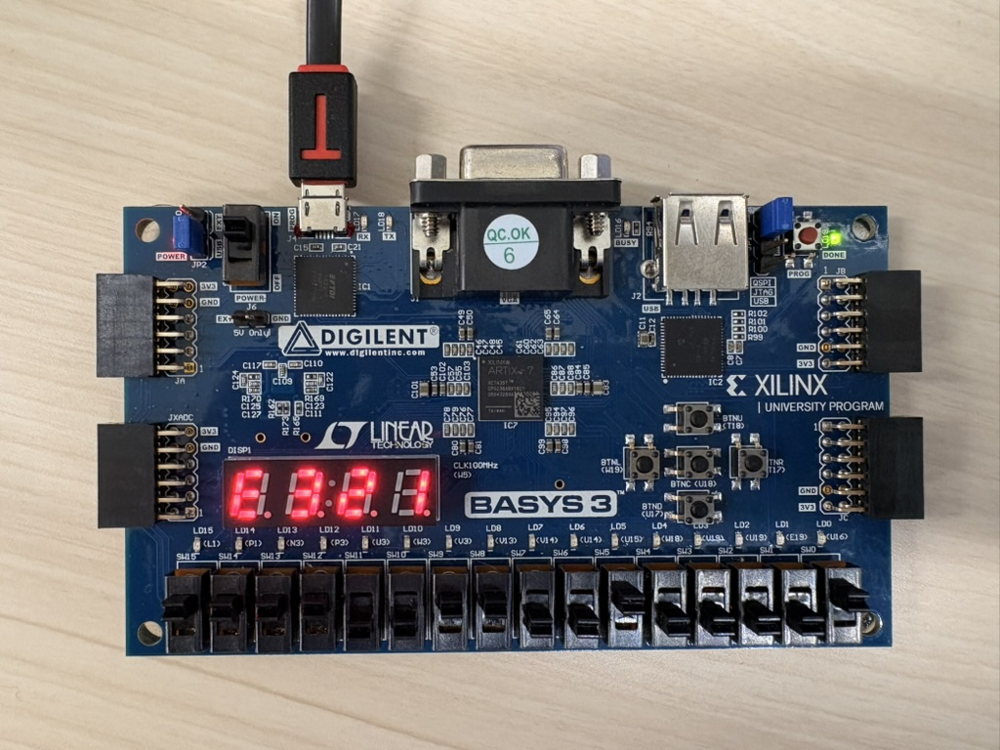

# 7セグメント

<h3>4I24 中川寛之</h3>

  

## レポート課題（１）

#### 1. ボードの理解
**(1) LED、ボタンスイッチの論理レベル**  
（回路図またはリファレンスマニュアルから調べた結果を記述してください。High/Low、Active High/Active Lowなど）

* **LED:**
    > **Active High (正論理)**  
    > FPGAのピンから Logic High (1) の電圧を出力すると点灯し、Logic Low (0) で消灯します。各LEDは330Ωの抵抗を介してアノード接続されています 。
* **ボタンスイッチ:**
    > **Active High (正論理)**  
    > モーメンタリ動作です。押している間だけ High (1) になり、離すと Low (0) に戻ります（Normally Low）。短絡防止用の直列抵抗が接続されています。

**(2) スライドスイッチの論理レベル**  
（デモプログラム `sw_led` から判断した結果を記述してください）

* **スライドスイッチ:**
    > **上が High (1)、下が Low (0)**  
    > スイッチの位置に応じて、常に一定の High または Low の信号を出力します。FPGAのピンとスイッチの間には保護用の直列抵抗が入っています。

## 2\. プログラムの完成、動作確認

**仕様確認:**

  * **クロック:** ピン番号W5（100MHz）に接続
  * **RESET:** BTNC（ピン番号U18）を利用
  * **値の入力:** SW15-0を利用（4桁の16進数として表示）
  * **SW設定:** 上にスライドで「1」、下で「0」

      

**動作確認結果:**

> 4桁の7セグメントディスプレイをダイナミック点灯方式で制御するプログラムを作成し、正常に動作することを確認しました。

> **回路の概要:**
>
>   * 100MHzのクロックを分周し、約1kHzの周期で4つの桁を順次点灯
>   * 各桁はカウンタで選択され、高速に切り替えることで全桁が同時に点灯しているように見える
>   * スイッチ入力(SW15-0)を4桁に分割し、それぞれ16進数(0-F)として表示
>   * リセットボタン(BTNC)で初期化可能
>

> **動作結果:**
>
>   * 各桁に0\~9の10進数を正しく表示できることを確認
>   * ダイナミック点灯により、全4桁が同時に点灯しているように見える
>   * リセットボタンで正常に初期化される

**ソースコード:**  
> レポートの可読性をあげるためソースコードはgithub上にコードを移しました。

**Display\_7seg.v (モジュール宣言部)**

[Display_7seg.v](https://github.com/HIROSN0W/4I_Experiments_report/blob/main/report5/src/Display_7seg.v)

**制約ファイル(Display\_7seg.xdc)**

[Display_7seg.xdc](https://github.com/HIROSN0W/4I_Experiments_report/blob/main/report5/src/Display_7seg.xdc)

#### 3. 予想外の入力への対応
**(1) 各桁に10以上の表示をした場合の結果**
（10以上の値を入力した際に表示がどうなったか、それは予想通りだったかを記述してください）

* **観測結果:**
    > 各桁のスイッチ入力を0から9（0000～1001）の範囲で変化させたところ、対応する10進数の数字（「0」～「9」）が7セグメントディスプレイに表示された。
* **考察（予想される結果か）:**
    > これは、作成したデコーダ回路（seg_dec）が、BCD（二化十進数）入力に対して正しいセグメント点灯パターンを出力していることを示している。

**(2) エラー表示の実装**
（10以上の入力があった際に "E" を表示させる処理について、実装方法や結果を記述してください）

* **実装内容・結果:**
    > [実装内容]  
        各桁の入力値が10進数で10以上（2進数で1010以上）の場合に、"E"（エラー）を表示するように7セグメントデコーダ部分を修正しました。具体的には、`current_digit`の値が`4'hA`(10)以上の場合は、すべて"E"のセグメントパターン(`7'b0000110`)を出力するように条件分岐を追加しました。

    > [結果]  
        > スイッチ入力で各桁に10以上の値（例: SW3-0 = 1010、1011、1100など）を設定したところ、該当する桁に"E"が正しく表示されることを確認しました。これにより、BCD（2進化10進数）の範囲外の値を視覚的に識別できるようになり、デバッグやエラー検出に有効であることが実証されました。
    

---

## レポート課題（２）

#### A. ダイナミック制御点灯方式とスタティック制御点灯方式の比較
（それぞれの利点・欠点を自分の言葉でまとめてください）

| 方式 | 利点 (メリット) | 欠点 (デメリット) |
| :--- | :--- | :--- |
| **ダイナミック制御点灯方式** | ・必要な配線数が少なく、回路構成がシンプルになる ・多桁表示でも使用するピン数を大幅に削減できる（本実験では4桁で11ピン） ・コストを抑えられる | ・高速に切り替えるための制御回路（クロック分周、カウンタ）が必要 ・切り替え周波数が低いとちらつきが発生する ・同時に全桁を点灯できないため、各桁の明るさが低下する |
| **スタティック制御点灯方式** | ・各桁が常時点灯しているため、明るく安定した表示が可能 ・制御回路が単純で、タイミング制御が不要 ・ちらつきが発生しない | ・桁数が増えると配線数とピン数が大幅に増加する（4桁で28ピン必要） ・回路が複雑になり、コストが高くなる ・消費電力が大きい |  

#### B. 実験のまとめ・考察
（本実験を通じて理解したこと、学んだこと、気づきなどを記述してください）

本実験では、7セグメントディスプレイのダイナミック点灯制御をFPGAで実装し、クロック分周やカウンタを用いた時分割表示の仕組みを理解することができた。  
特に、100MHzのクロックを約1kHzに分周して桁を高速切り替えることで、人間の目には全桁が同時に点灯しているように見える原理を実感した。また、エラー表示の実装を通じて、条件分岐による柔軟な制御の重要性を学んだ。  
ダイナミック方式はピン数を削減できる反面、制御回路が複雑になるというトレードオフがあり、実用的な回路設計では要求仕様に応じた方式選択が重要であることを認識した。  