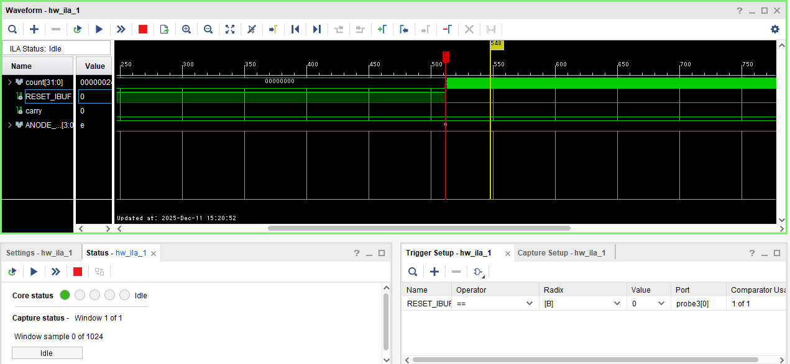
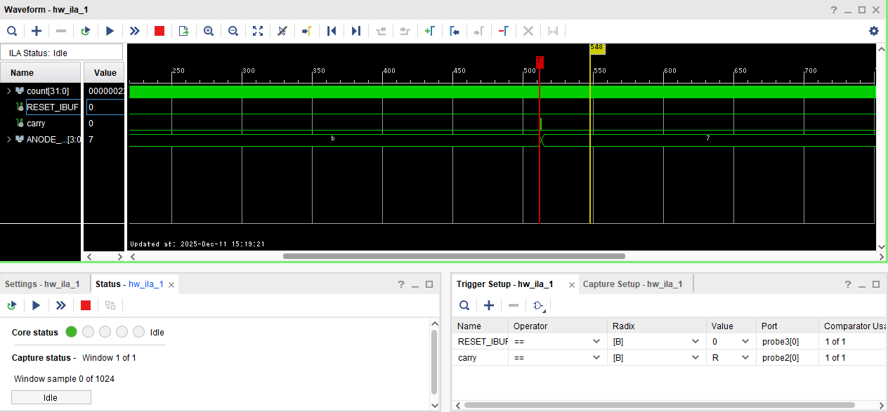
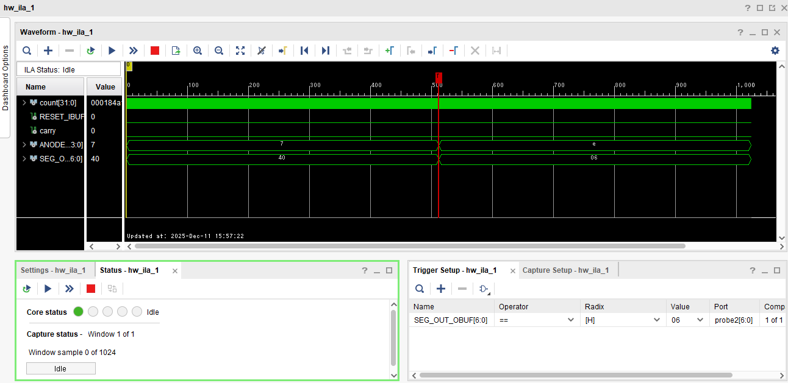

# 7セグメント LSI

<h3>4I24 中川寛之</h3>

  

## 1. 実験の目的・目標

* **ILA (Integrated Logic Analyzer) の習得**
    * テストベンチによるシミュレーションでは時間がかかり、実動作状態での確認が難しい場合があるため、FPGA内部に回路として組み込むロジックアナライザ（ILA）を用いた確認方法を学びます。
* **実動作状態での確認**
    * 回路の内部信号を観察し、実際の動作状態で波形表示や動作確認を行います。

## 2. 使用ツール・環境

* **FPGAボード**: 実験対象のハードウェア
* **Vivado**: 開発環境（合成、配置配線、ビットストリーム生成、Hardware Managerなど）
* **ILA (IPコア)**: FPGA内部に組み込むロジックアナライザ機能

## 3. 実験手順

この実験では、以下のフローでILAを組み込み、波形観測を行います。

###### コードの修正（信号のマーク）
* RTL記述（Verilog HDL）において、観察したい信号（`carry`, `count`など）に `(* mark_debug = "TRUE" *)` という属性を追加します。

###### 論理合成 (Synthesis) とデバッグ設定
1.  **Run Synthesis** を実行します。
2.  完了後、**Set Up Debug** ウィザードを開き、観察するネット（信号）やクロックドメインを確認します。
3.  サンプルデータ数（例: 1024）などを設定し、デバッグ設定を完了します。

###### 配置配線 (Implementation) とビットストリーム生成
1.  **Run Implementation** を実行します（ILA情報がXDCファイルに保存されます）。
2.  続いて **Generate Bitstream** を実行し、回路情報を作成します。

###### FPGAへの書き込み
* **Hardware Manager** を開き、`Open Target` -> `Program Device` を実行します。この際、ビットストリームファイル (`.bit`) とデバッグプローブファイル (`.ltx`) を書き込みます。

###### ILAダッシュボードでの操作
1.  **プローブ追加**: Waveformウィンドウに観察したい信号（`carry`, `count`）を追加します。
2.  **トリガ設定**: 特定の条件（例: `count == 999980` など）で波形取得を開始するようにトリガ条件を設定します。
3.  **実行と観察**: `Run trigger` をクリックし、トリガ条件が成立した前後の波形を観察します。
    * 必要に応じてキャプチャモード（ウィンドウ数やデータ深度）を調整します。

## 4. 課題内容

ILAを用いて実際の波形を確認し、以下の3点について説明することが求められています。

1.  **RESET解除後の動作**: RESETを解除した際、`count` のカウントアップが始まることを確認する。  

    **<考え方>**  
    RESET解除で、countのカウントが始まること。
    1. 観察すべき信号は？（`RESET`, `count`, carry, ANODE）  
     → 信号をマーク、信号プローブに追加
    1. トリガは？
    （RESET, count, carry, `ANODE`）信号の  
    → トリガプローブに追加
    （立ち上がり，`立ち下がり`，Hレベル，Lレベル）  
    → トリガ設定
    2. Run Triggerを実行  
    3. RESETを解除するには（トリガを発動）  
    → （`RESET`, count, carry）を離す.
    

2.  **桁の切り替わり**: `carry` 信号によって、7セグメントLEDの表示桁が変化することを確認する。  
    **<考え方>**  
    1. 観察すべき信号は？（RESET, count, `carry`, `ANODE`）
    → 信号をマーク、信号プローブに追加
    2. 動作の要因は？
    （RESET, count, `carry`, ANODE）信号の
    → トリガプローブに追加
    （`立ち上がり`，立ち下がり，Hレベル，Lレベル）
    → トリガ設定
    3. ANODEは`回転シフト`通り、順に変化。
    → 複数ウィンドウを設定
    

3.  **エラー表示の特定**: ”E”と表示された時の内部値（`value`）は何か、またそれは何桁目で発生したかを確認する。　　

    1. １つの桁に”E”を表示しておく。
    2. ”E”が表示される信号は？”E”のセグメント値は？
    → トリガプローブに追加、トリガ値を設定
    3. ”E”表示になってしまった値の信号は？
    → 信号プローブに追加
    4. 表示桁の信号は？
    → 信号プローブに追加
    