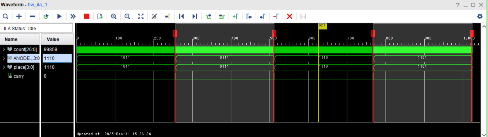

# 7セグメント LSI

<div style="text-align: right;">
<h3>4I24 中川寛之</h3>
</div>  

## 1. 実験の目的・目標

* **ILA (Integrated Logic Analyzer) の習得**
    * テストベンチによるシミュレーションでは時間がかかり、実動作状態での確認が難しい場合があるため、FPGA内部に回路として組み込むロジックアナライザ（ILA）を用いた確認方法を学ぶ。
* **実動作状態での確認**
    * 回路の内部信号を観察し、実際の動作状態で波形表示や動作確認を行う。

## 2. 使用ツール・環境

* **FPGAボード**: 実験対象のハードウェア
* **Vivado**: 開発環境（合成、配置配線、ビットストリーム生成、Hardware Managerなど）
* **ILA (IPコア)**: FPGA内部に組み込むロジックアナライザ機能

## 3. 実験手順

この実験では、以下のフローでILAを組み込み、波形観測を行う。

###### コードの修正（信号のマーク）
* RTL記述（Verilog HDL）において、観察したい信号（`carry`, `count`など）に `(* mark_debug = "TRUE" *)` という属性を追加。

###### 論理合成 (Synthesis) とデバッグ設定
1.  **Run Synthesis** を実行。
2.  完了後、**Set Up Debug** ウィザードを開き、観察するネット（信号）やクロックドメインを確認。
3.  サンプルデータ数（例: 1024）などを設定し、デバッグ設定を完了。

###### 配置配線 (Implementation) とビットストリーム生成
1.  **Run Implementation** を実行（ILA情報がXDCファイルに保存）。
2.  続いて **Generate Bitstream** を実行し、回路情報を作成。

###### FPGAへの書き込み
* **Hardware Manager** を開き、`Open Target` -> `Program Device` を実行。この際、ビットストリームファイル (`.bit`) とデバッグプローブファイル (`.ltx`) を書き込む。

###### ILAダッシュボードでの操作
1.  **プローブ追加**: Waveformウィンドウに観察したい信号（`carry`, `count`）を追加。
2.  **トリガ設定**: 特定の条件（例: `count == 999980` など）で波形取得を開始するようにトリガ条件を設定。
3.  **実行と観察**: `Run trigger` をクリックし、トリガ条件が成立した前後の波形を観察。
    * 必要に応じてキャプチャモード（ウィンドウ数やデータ深度）を調整。

## 4. 課題内容

1.  **RESET解除後の動作**: RESETを解除した際、`count` のカウントアップが始まることを確認する。  

    **<考え方>**  
    RESET解除で、countのカウントが始まること。
    1. 観察すべき信号は？（`RESET`, `count`, carry, ANODE）  
     → 信号をマーク、信号プローブに追加
    1. トリガは？
    （RESET, count, carry, `ANODE`）信号の  
    → トリガプローブに追加
    （立ち上がり，`立ち下がり`，Hレベル，Lレベル）  
    → トリガ設定
    2. Run Triggerを実行  
    3. RESETを解除するには（トリガを発動）  
    → （`RESET`, count, carry）を離す.
    

    **<考察>**   
    RESET信号の立ち下がりエッジをトリガ条件として設定し、波形を観測した結果、RESET解除直後から`count`が0から順次カウントアップしていることが確認できた。  
    これにより、リセット機能が正常に動作し、カウンタ回路が期待通りに初期化されてから動作を開始することが実証された。ILAを用いることで、実際のFPGA上での動作タイミングを正確に捉えることができ、テストベンチでは確認しづらい実動作状態での挙動を検証できた。
---

2.  **桁の切り替わり**: `carry` 信号によって、7セグメントLEDの表示桁が変化することを確認する。  
    **<考え方>**  
    1. 観察すべき信号は？（RESET, count, `carry`, `ANODE`）
    → 信号をマーク、信号プローブに追加
    2. 動作の要因は？
    （RESET, count, `carry`, ANODE）信号の
    → トリガプローブに追加
    （`立ち上がり`，立ち下がり，Hレベル，Lレベル）
    → トリガ設定
    3. ANODEは`4(回転シフト)`通り、順に変化。
    → 複数ウィンドウを設定
    

    **<考察>**  
    `carry`信号の立ち上がりエッジをトリガとして設定し、複数ウィンドウで波形を観測した結果、carry信号が発生するたびに`ANODE`が **1110 → 1101 → 1011 → 0111 → 1110...** と回転シフトしていることが確認できた。  
    この動作により、4桁の7セグメントLEDが順次切り替わり、人間の目には同時に点灯しているように見えるダイナミック点灯方式が実現されている。これにより、限られたI/Oピン数で複数桁の表示を効率的に制御できることが実証された。
---

3.  **エラー表示の特定**: ”E”と表示された時の内部値（`value`）は何か、またそれは何桁目で発生したかを確認する。　　

    **<考え方>** 
    1. １つの桁に”E”を表示しておく。
    2. ”E”が表示される信号は？”E”のセグメント値は？
    → トリガプローブに追加、トリガ値を設定
    3. ”E”表示になってしまった値の信号は？
    → 信号プローブに追加
    4. 表示桁の信号は？
    → 信号プローブに追加
    

    **<考察>** 　　

    ### SEG_OUT = 06 でトリガを設定する理由
    
    `SEG_OUT`は7セグメントディスプレイの各セグメント（a～g）を制御する7ビットの信号で、実験で使用しているボードはアノードコモン方式のため、各ビットが「0（Low）で点灯、1（High）で消灯」という負論理で動作している。
    
    "E"という文字を表示するには、以下のセグメントを制御する必要がある：
    - **点灯させるセグメント**: a, d, e, f, g → 信号値「0」
    - **消灯させるセグメント**: b, c → 信号値「1」
    
    これをビット列（g, f, e, d, c, b, a の順）で表すと：
    ```
    0000110 (2進数) = 06 (16進数)
    ```
    
    つまり、**`SEG_OUT = 06`というトリガ条件を設定することで、"E"が表示された瞬間を検出できる**。これにより、エラー表示が発生した時の`value`（内部値）と`ANODE`（表示桁）を正確に捕捉し、何桁目でどのような値が原因でエラー表示になったかを特定することができた。
    
    今回の波形観測から、10を超える値が入力された際に"E"表示となることが確認でき、7セグメントディスプレイの正常な数値範囲（0～9）を超えた場合のエラーハンドリングが適切に機能していることが実証された。  

## 感想　　

本実験を通じて、ILAを用いた実機デバッグの有効性を実感した。  
特に、テストベンチによるシミュレーションでは時間的制約から確認が困難な長時間動作だったり、実際のハードウェア上でのタイミングを正確に観測できる点が有効性を感じた。  
トリガ条件を適切に設定することで、膨大な動作の中から特定の瞬間を捕捉できることも理解できた。  
また、7セグメントディスプレイのダイナミック点灯方式や負論理による制御など、実際の回路設計における工夫を学ぶことができたと思う。
