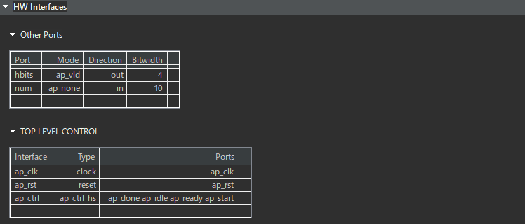
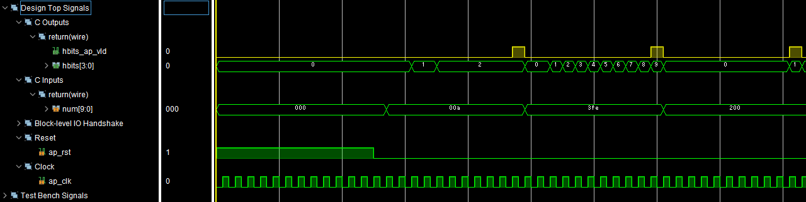
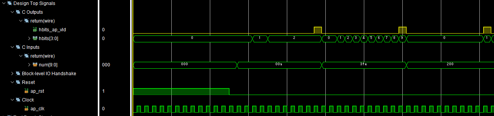
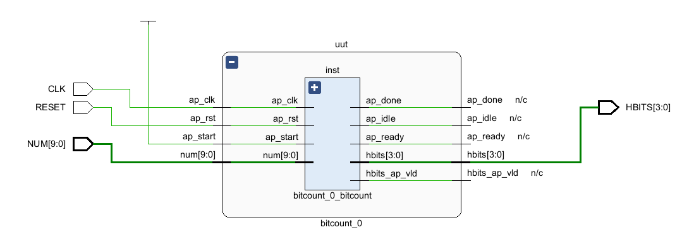

# 高位合成

<div style="text-align: right;">
<h3>4I24 中川寛之</h3>
</div>  

```
C:/Xilinx/Vitis_HLS/2023.2/include/floating_point_v7_1_bitacc_cmodel.h:142:0: note: this is the location of the previous definition
 #define __GMP_LIBGMP_DLL 1
 
00A -> 2
3FE -> 9
200 -> 1
```

```
INFO: [RTGEN 206-500] Setting interface mode on port 'bitcount/num' to 'ap_none'.
INFO: [RTGEN 206-500] Setting interface mode on port 'bitcount/hbits' to 'ap_vld'.
INFO: [RTGEN 206-500] Setting interface mode on function 'bitcount' to 'ap_ctrl_hs'.
INFO: [RTGEN 206-100] Finished creating RTL model for 'bitcount'.
INFO: [HLS 200-111] Finished Creating RTL model: CPU user time: 0 seconds. CPU system time: 0 seconds. Elapsed time: 0.04 seconds; current allocated memory: 141.820 MB.
INFO: [HLS 200-111] Finished Generating all RTL models: CPU user time: 0 seconds. CPU system time: 0 seconds. Elapsed time: 0.222 seconds; current allocated memory: 146.844 MB.
INFO: [HLS 200-111] Finished Updating report files: CPU user time: 0 seconds. CPU system time: 0 seconds. Elapsed time: 0.449 seconds; current allocated memory: 151.129 MB.
INFO: [VHDL 208-304] Generating VHDL RTL for bitcount.
INFO: [VLOG 209-307] Generating Verilog RTL for bitcount.
INFO: [HLS 200-790] **** Loop Constraint Status: All loop constraints were satisfied.
INFO: [HLS 200-789] **** Estimated Fmax: 167.03 MHz
```




  

```
INFO: [Common 17-206] Exiting xsim at Mon Jan  5 17:20:55 2026...
INFO: [COSIM 212-316] Starting C post checking ...
00A -> 2
3FE -> 9
200 -> 1
```  




