# オペアンプ

<h3>4I24 中川寛之</h3>

  

## 目的
- オペアンプを用いた増幅回路を製作し、その特性を測定する。
- 反転増幅器と非反転増幅器について、外付け抵抗を用いて利得が設定できることを確認する。  

## 使用機材
- ファンクションジェネレータ
- オシロスコープ
- 電源
- オペアンプ

### 反転増幅回路
---

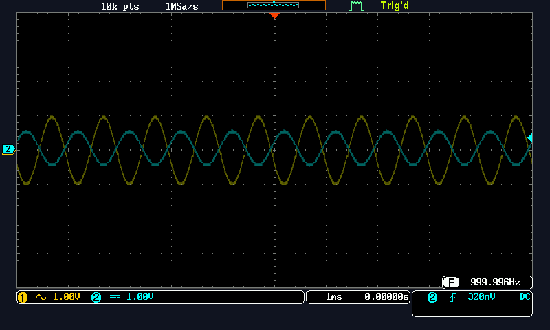  
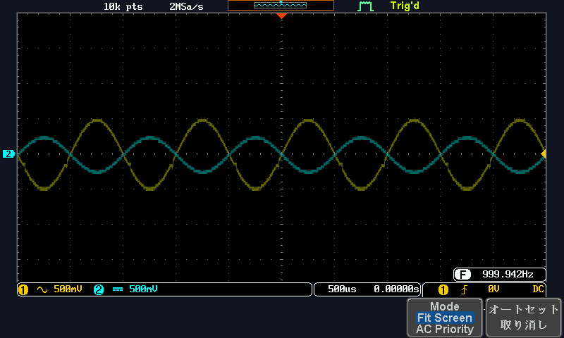  
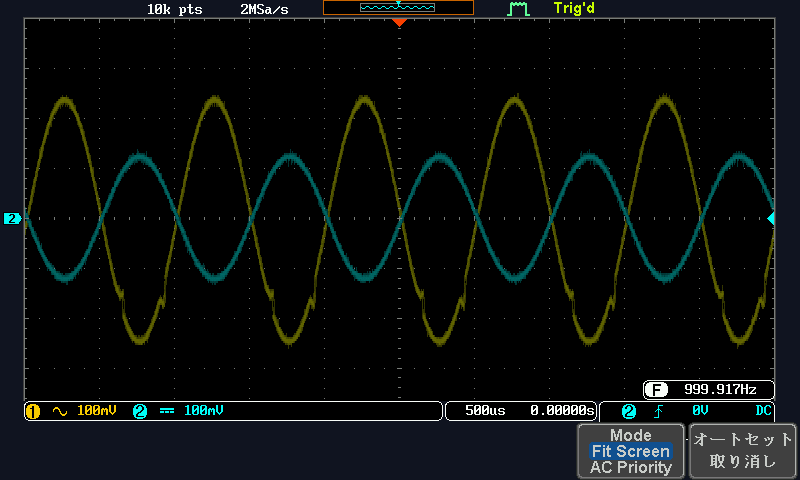  
---  

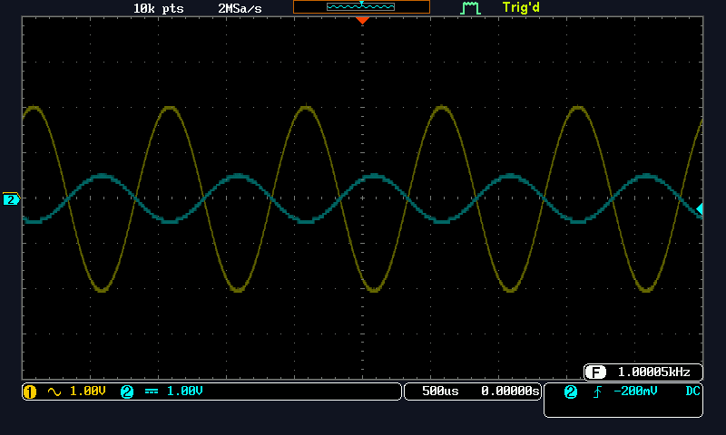  
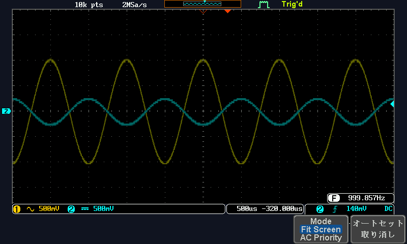  
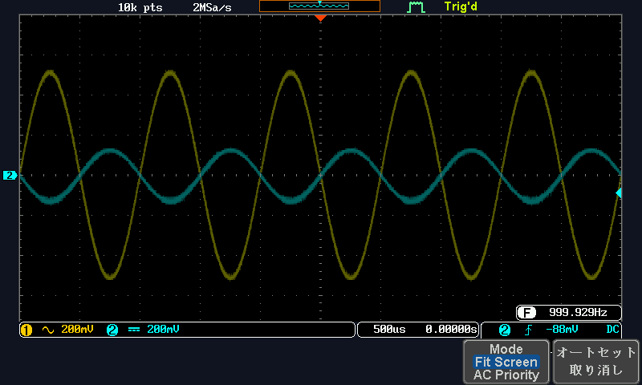  

### 非反転増幅回路
---  
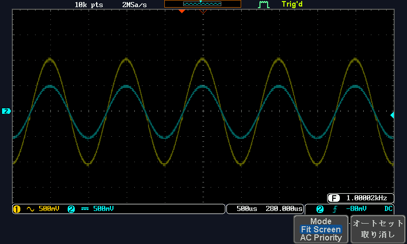  
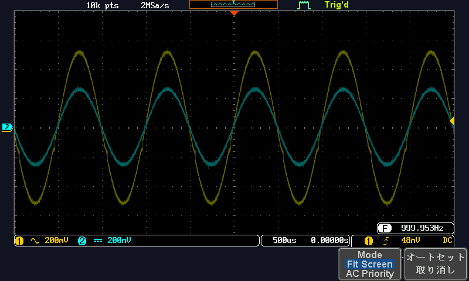  
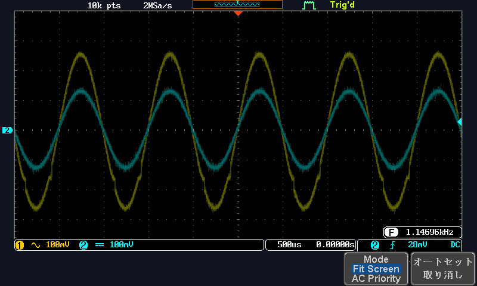  

---  

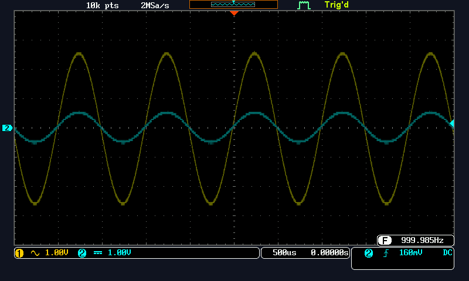  
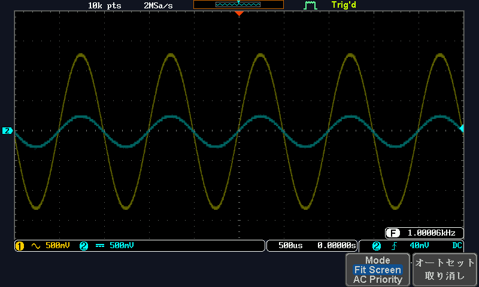  
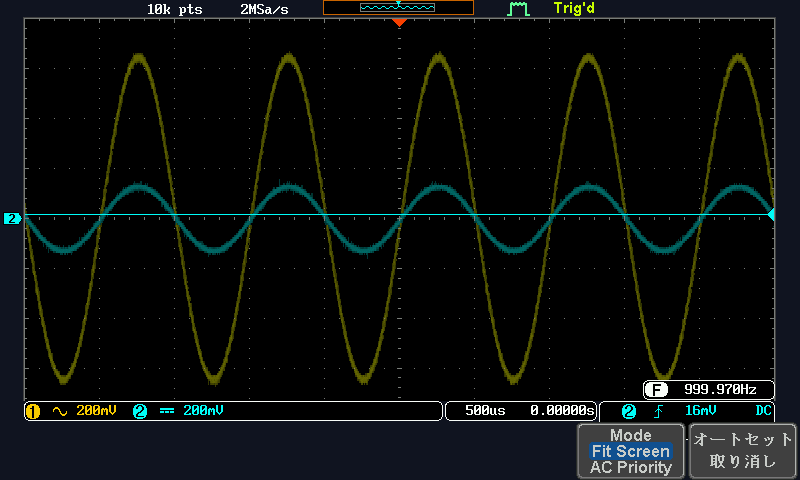  

### 電圧フォロア  
---  
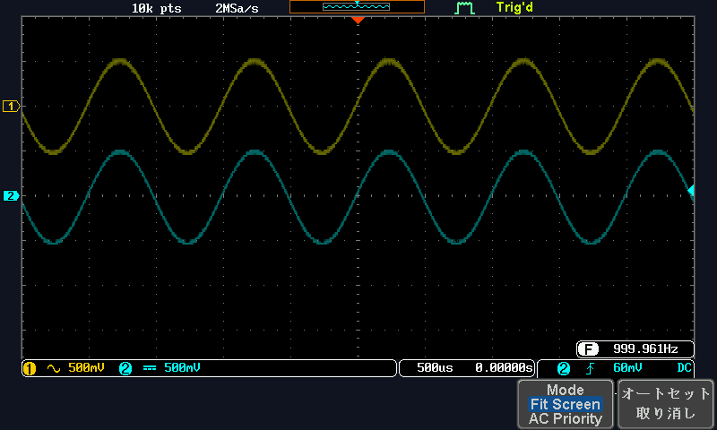  
  
  
---  
  
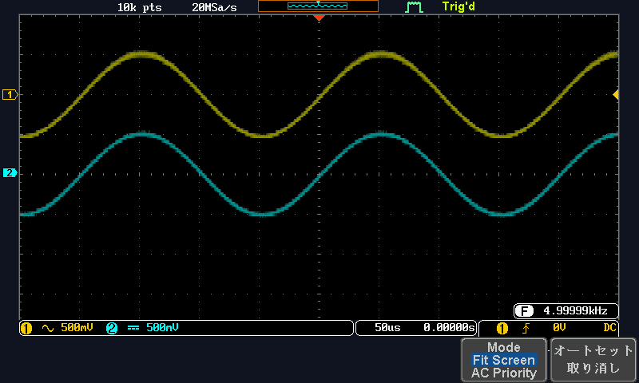  
 
  
  
   
   
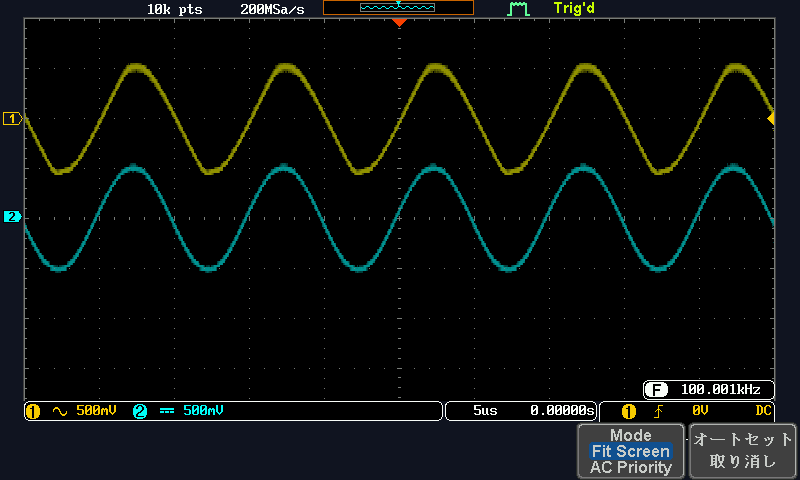  
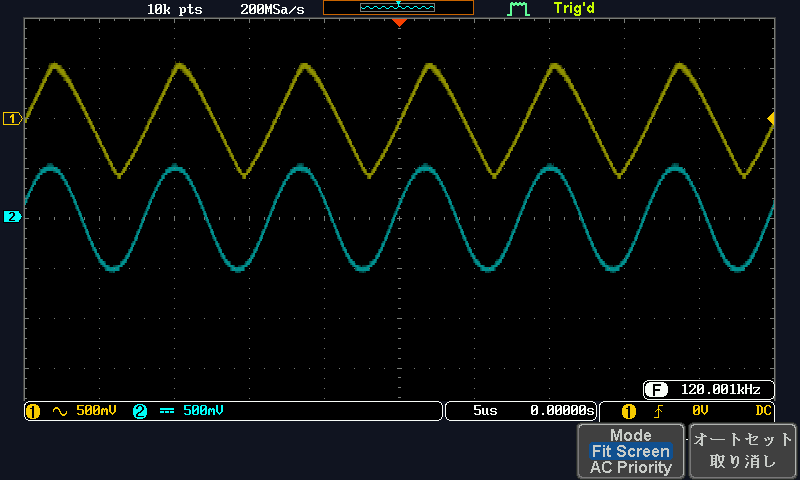  
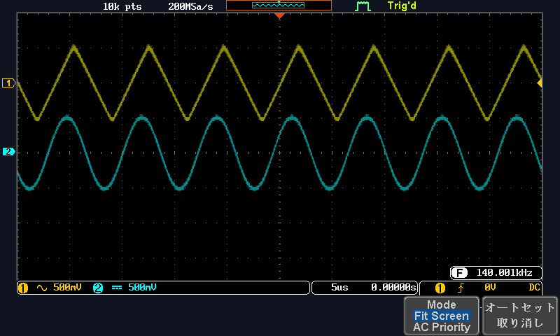  
  