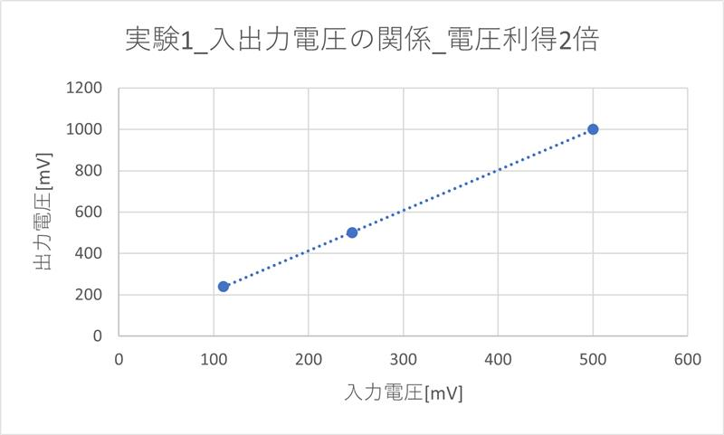
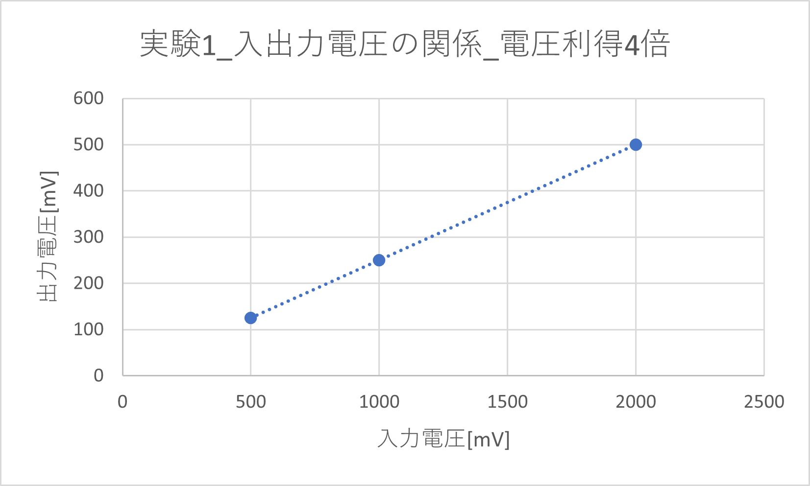
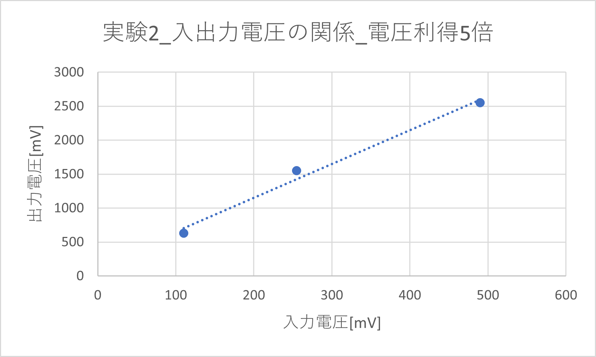
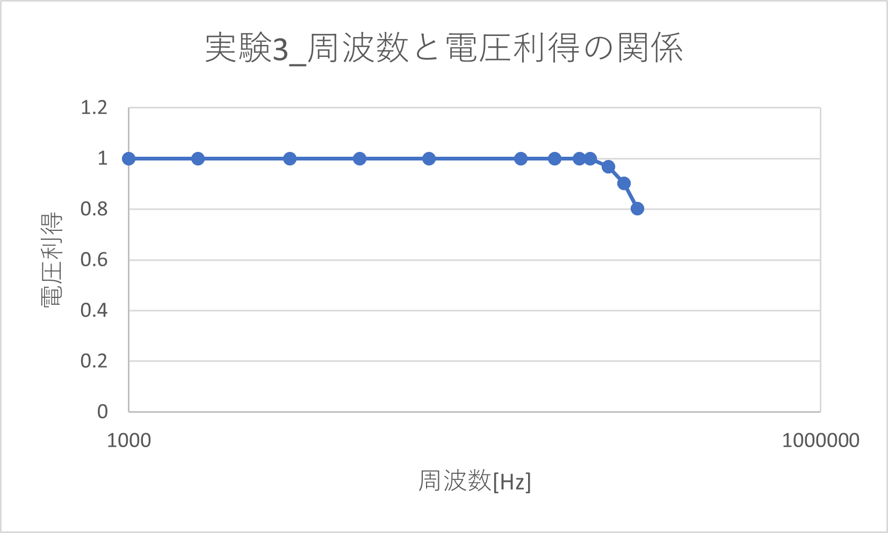

# オペアンプ

<h3>4I24 中川寛之</h3>

  

## 1. 目的
- オペアンプを用いた増幅回路を製作し、その特性を測定する。
- 反転増幅器と非反転増幅器について、外付け抵抗を用いて利得が設定できることを確認する。  

## 2. 使用機材
- ファンクションジェネレータ
- オシロスコープ
- 電源
- オペアンプ

## 3. オペアンプ  
オペアンプの初段は差動増幅回路であり、２個の入力V1とV2の差分を増幅する。  
オペアンプ単体の特徴は  
- (a)非常に大きな電圧利得  
- (b)非常に大きな入力インピーダンス  
- (c)非常に小さな出力インピーダンスであり、外付けの抵抗等と組み合わせて様々な機能を実現できる。

### **3-1.　反転増幅回路**
---
オペアンプの差動利得（オープンループ利得）を $A$、入力電圧を $V_1, V_2$、出力電圧を $V_o$ とした基本式。
$$
V_o = A(V_2 - V_1) \tag{1}
$$

反転増幅回路において、入力インピーダンスが無限大であるため抵抗 $R_1$ と $R_2$ を流れる電流が等しいことを示す式。
$$
\frac{V_i - V_1}{R_1} = \frac{V_1 - V_o}{R_2} \tag{2}
$$

仮想短絡（$V_1=V_2$）および仮想接地（$V_2=0$ より $V_1=0$）の条件を用いて導出された、反転増幅回路の出力電圧 $V_o$ の式。
$$
V_o = -\frac{R_2}{R_1}V_i \tag{3}
$$

反転増幅回路の電圧利得 $A_v$ を示す式。
$$
A_v = \frac{V_o}{V_i} = -\frac{R_2}{R_1} \tag{4}
$$

---

#### オシロスコープの波形
- [ r2=2kΩ r1=1kΩ ampl=1.0kHz ]
     

- [ r2=30kΩ r1=7.5kΩ ampl=1.0kHz ]
      

#### 測定データ
- **[ r2=30 r1=7.5 ]**  
    | 入力電圧 [mV] | 出力電圧 [mV] |
    |---:|---:|
    | 500 | 1000 |
    | 246 | 500 |
    | 110 | 240 |

- **[ r2=30 r1=7.5 ]**  
    | 入力電圧 [mV] | 出力電圧 [mV] |
    |---:|---:|
    | 2000 | 500 |
    | 1000 | 249 |
    | 500 | 127 |

#### 表
- 電圧利得_**2倍**

  
- 電圧利得_**４倍**

### **３−２.　非反転増幅回路**
---  
非反転増幅回路において、入力信号 $V_i$ がオペアンプのプラス入力端子 $V_2$ に接続されていることを示す式。
$$
V_i = V_2 \tag{5}
$$

非反転増幅回路において、抵抗 $R_1$ の片側が接地されており、抵抗 $R_1$ と $R_2$ を流れる電流が等しいことを示す式。
$$
\frac{0 - V_1}{R_1} = \frac{V_1 - V_o}{R_2} \tag{6}
$$

仮想短絡（$V_1=V_2$）および(5)式の条件を(6)式に代入して導出された、非反転増幅回路の出力電圧 $V_o$ の式。
$$
V_o = \left(1 + \frac{R_2}{R_1}\right)V_i \tag{7}
$$

非反転増幅回路の電圧利得 $A_v$ を示す式。
$$
A_v = \frac{V_o}{V_i} = 1 + \frac{R_2}{R_1} \tag{8}
$$
---   

#### オシロスコープの波形

- [ r2=1kΩ r1=1kΩ ampl=1.0kHz ]
     

- [ r2=30kΩ r1=7.5kΩ ampl=1.0kHz ]
     

#### 測定データ

- **[ r2=1 r1=1 ]**  
    | 入力電圧 [mV] | 出力電圧 [mV] | 電圧利得 |
    |---:|---:|---:|
    | 500 | 1000 | 2 |
    | 250 | 530 | 2.12 |
    | 130 | 270 | 2.076923 |

- **[ r2=３０ r1=７．５ ]**  
    | 入力電圧 [mV] | 出力電圧 [mV] | 電圧利得 |
    |---:|---:|---:|
    | 490 | 2550 | 5.204082 |
    | 255 | 1550 | 6.078431 |
    | 110 | 630 | 5.727273 |

#### 表
- 電圧利得_**2倍**

  
- 電圧利得_**5倍**

### **３-3.　電圧フォロア**  

#### オシロスコープの波形

- [ r2=1kΩ r1=1kΩ ampl=1.0kHz ]
      

- [ r2=2kΩ r1=1kΩ ampl=160.0kHz ]
     

#### 測定データ
| 入力電圧 [mV] | 出力電圧 [mV] | 周波数 [Hz] | 電圧利得 |
|---:|---:|---:|---:|
| 500 | 500 | 50000 | 1 |
| 500 | 500 | 70000 | 1 |
| 500 | 500 | 90000 | 1 |
| 500 | 500 | 100000 | 1 |
| 500 | 484 | 120000 | 0.968 |
| 500 | 451 | 140000 | 0.902 |
| 500 | 401 | 160000 | 0.802 |

#### 表

 - 周波数と電圧利得の関係
    
 
提示されたレポートの続きとして、実験結果に基づいた「考察」と「結論」を作成しました。
実験データ（特に非反転増幅回路のゲインのばらつきや、ボルテージフォロワの高周波特性）およびオシロスコープの画像から読み取れる内容を反映させています。

---

### **4. 考察**

#### **4-1. 反転増幅回路の特性**

オシロスコープの波形（DS0001, DS0004）より、入力波形（水色）に対して出力波形（黄色）の位相が180度反転していることが確認できた。これは式(3)におけるマイナスの符号と一致しており、反転増幅回路として正常に動作していると言える。

電圧利得について、抵抗値から求められる理論値と測定結果を比較する。

* **ケース1 ()**
* 理論値： 倍
* 画像(DS0001)および測定データより、入力振幅に対し約2倍の出力が得られており、理論と一致した。

* **ケース2 ()**
* 理論値： 倍
* 画像(DS0004)では、入力1divに対し出力が約4div振れており、理論通りの増幅率4倍が確認できた。

#### **4-2. 非反転増幅回路の特性**

波形より、入力波形と出力波形の位相が同相であることが確認できた。これは式(7)の符号が正であることと一致する。

電圧利得について考察する。

**ケース1**
* 理論値： ２倍
* 測定データでは500mV入力時に1000mV出力となっており、正確に2倍の利得が得られた。

**ケース2**
* 理論値： ５倍
* 測定データでは、利得が5.2〜6.0倍と理論値よりも大きな値を示した。
* **誤差の要因：** 使用した抵抗器の許容差（誤差）が考えられる。例えば、が公称値より大きく、が小さかった場合、式(8)の項  が大きくなり、全体としてゲインが増加する。また、入力電圧が小さい場合（110mV時）は、ノイズや読み取り誤差の影響が顕著に出たと推測される。

#### **4-3. 電圧フォロワの周波数特性**

電圧フォロワは、理論上  となり、電圧利得は1（0dB）である。低周波領域（50kHz〜100kHz）では、測定データ通り利得1を維持しており、入力信号をそのまま出力するバッファとして機能している。

しかし、周波数が120kHzを超えたあたりから出力電圧の低下が見られた。

* 100kHz：利得 1.0
* 160kHz：利得 0.802

この利得低下の原因として、オペアンプのスルーレート（Slew Rate）または利得帯域幅積（GB積）の限界が考えられる。
高周波になるほど、オペアンプの出力電圧の変化速度が入力信号の変化に追いつけなくなり、波形が歪んだり振幅が減少したりする現象である。画像(DS0026)において波形を確認すると、正弦波の頂点が追従しきれずに振幅が低下している様子が読み取れる。これにより、使用したオペアンプには応答可能な周波数帯域に限界があることが実証された。

## **5. 結論**

本実験を通じて、オペアンプを用いた基本回路（反転増幅、非反転増幅、電圧フォロワ）の設計と特性測定を行った。

1. **増幅動作の確認：** 外付け抵抗  の比率を変えることで、理論式通りに任意の電圧利得を設定できることを確認した。
2. **位相特性：** 反転増幅回路では逆位相、非反転増幅回路では同位相で出力されることを波形で確認した。
3. **周波数特性：** オペアンプには周波数特性があり、高い周波数では利得が低下することを確認した。実際の回路設計においては、必要な帯域幅を考慮してオペアンプを選定する必要があることを学んだ。
